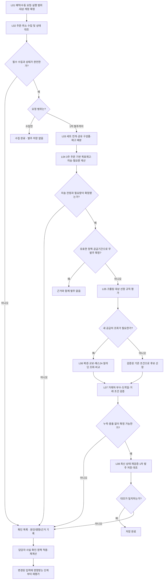
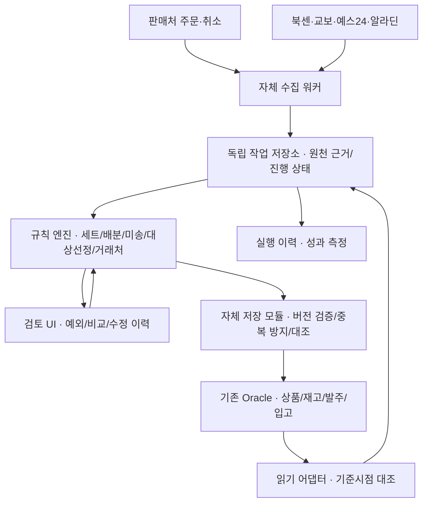

# 제이북스 발주자동화 · PRD & 로직보드

**v0.5 · 실프로그램 검증 반영 · 2026.09.20**  
기준 자료: 고객 요청, 노션 현장 메모, 2026.09.17 현장 영상 3편, 현장영상 반영 재기획 v4, 2026.09.20 실프로그램 검증 E01부터 E08.

> 주문·취소를 수집하고 세트·재고·미송을 함께 계산한 뒤, 필요한 상품의 거래처와 발주 부수를 확정하여 제이북스에 저장한다. 사람이 확인해야 할 건에는 이유와 판단 근거를 남긴다.

## 01. 제품 목표와 완료의 정의

오전 담당자의 반복 작업을 줄여 **하루 약 2시간을 확보하는 것**이 고객의 목표다. 절감량은 아직 측정하지 않았다. 영상은 오후 작업 중심이므로 오전의 주문량·거래처 구성·대기시간을 별도로 측정한다.

**1차 발주 완료**는 다음을 모두 만족한 상태다.

1. 기준시각까지 필요한 판매처·계정의 주문과 취소를 빠짐없이 확인했다.
2. 주문 상태, 세트 구성, 재고, 기존 발주·입고를 대조하여 신규 발주 필요량을 산출했다.
3. 크롤링 대상은 공급처 조회와 비교를 마쳤으며, 실제 거래처와 부수가 정해졌다.
4. 제이북스의 1차 발주 상태로 저장하고, 저장한 거래처·수량·상태를 다시 조회하여 대조했다.

**‘크롤링’으로 임시 지정한 상태는 완료가 아니다.** 확인이 필요한 행이 남으면 실행 결과는 ‘부분 완료’이며, 수집 누락이 있으면 ‘수집 미완료’로 표시한다. 저장 대상이 없는 정상 실행은 모든 수요가 재고·유효 공급으로 충족됐다는 근거가 있어야 ‘발주 없음’으로 종료한다.

| 범위 | 이번 제품에 포함 | 경계 |
|---|---|---|
| P0 · 반드시 구현 | 예약·수동 주문/취소 수집 및 상태 반영, 실패/기간 재수집, 세트 조정, 재고·미송 계산 | 공통 수집 모듈·중복 실행 방지; 수집만/1차 발주까지의 실행 범위 구분 |
| P0 · 반드시 구현 | 크롤링 대상 선정, 북센·교보·예스24·알라딘 비교, 거래처·부수 확정 | 4개 조회 경로를 새 코드로 구현·검증; 수동 파일이 개입하면 자동 처리로 집계하지 않음 |
| P0 · 반드시 구현 | 이전 이력·최근 3주 주문 기반 적정재고 산식, 1차 발주 저장, 예외 확인, 재시작·대조 | 산식과 가중치는 과거 재현·시험으로 검증; 불완전한 입력은 확인 목록으로 이동 |
| P1 · 후속 고도화 | 계절·행사 예측, 적정재고 모델 고도화, 가격 추세, 묶음 구매 최적화 | P0 산식 대비 추가 효과를 과거 이력과 운영 결과로 평가 |
| 이번 범위 밖 | 공급처 주문 전송·결제, 장바구니 변경, 반품 후 재매입, 손실을 이유로 한 고객 주문 자동 취소 | 별도 제품 범위로 결정해야 함 |

기존 프로그램의 코드·스크립트·업무 로직을 호출하여 재사용하지 않고 **자체 코드로 구현**한다. 기존 DB의 트리거·제약·채번·후속 처리 관계는 조사하고, 운영 데이터가 갖춰야 할 조건을 충족하는 저장 계약을 만든다.

## 02. 근거와 확정 수준

이 문서의 ‘관찰’은 실제 화면·발언에서 확인한 사실, ‘규칙 후보’는 일반화 검증이 필요한 판단, ‘설계 제안’은 신규 도구의 동작 제안이다. 초안의 제안을 운영 승인된 규칙으로 취급하지 않는다.

| 항목 | 수준 | 현재 알 수 있는 내용 | 남은 검증 |
|---|---|---|---|
| 완료 범위·자체 개발 | 고객 요청 | 수집·처리 후 거래처·부수 저장까지 | DB의 저장과 전송 상태 경계 |
| 세트 조정·구성품 중복 | 현장 관찰 | 겹치는 낱권 수요를 함께 계산해야 함 | 구성표·수불·실제 저장 단위 |
| 크롤링 지정 | 규칙 후보 | ‘보통 65가 아니면’ 조회한다는 발언과 특정 거래처 예외 | 공급률 필드·단위·예외 우선순위·적용 범위 |
| 미송 정책 | 고객 사례·현장 관찰 | 잔량을 유지하는 거래처와 재발주가 필요한 거래처가 공존 | 원발주별 종료·배송·예정일·연락 결과 |
| 적정재고·판매량 | 고객 추가 요청·산식 초안 | 이전 이력과 최근 3주 주문으로 목표재고·발주량 계산 | 취소·세트 단위, 가중치·이전 기간, 거래처별 보충기간·안전재고 검증 |
| 자동 처리의 보류·대조 | 설계 제안 | 모호한 상태는 이유를 표시하고 재계산 | 고객 검토와 시험 시나리오 통과 |

V55 34:02–36:03의 ‘65’는 **공급률**에 관한 발언이다. 할인율이나 모든 상품에 적용할 고정 임계값으로 확정하지 않는다. 값이 65여도 견적이 오래됐거나 재고·거래 조건이 불명확하면 확인이 필요하다.

**추가 관찰 E01부터 E08:** 실행 중인 v1.0.0.94의 7개 업무 화면을 열람하고, 매입처명 한정 조회와 한 발주 회차 조회만 수행했다. 화면 구조와 5개 결과 행의 존재를 확인했으며 운영 수집·취소처리·발주 저장·재고 조정·DB 연결은 하지 않았다. 10개 그룹·27개 표시 계정은 활성 계정 수가 아니다. 서버 정보는 고객 제공 자료이며 이번 열람으로 재확인하지 않았다.

## 03. 업무 로직보드



### 단계별 입력과 산출물

| 단계 | 입력 | 처리·분기 | 반드시 남기는 결과 |
|---|---|---|---|
| L01 시작 | 예약/수동 요청, 실행 범위, 활성 계정, 회차·기준시각·정책 버전 | 공통 대기열·계정별 실행권, 오전/오후 회차 구분 | 실행 ID, 요청자/예약 ID, 대상·조회 범위·기준시각 |
| L02 수집 | 원주문·취소 이벤트, 이전 처리 이력 | 중복 제거, 부분취소·역순 이벤트·출고 상태 대조 | 원천 키, 상태 버전, 계정별 완전성 |
| L03 세트·재고 | 세트 구성, 원수요, 완성 세트·낱권 재고 | 공유 구성품 합산, 한 번만 재고 배분 | 원주문→세트→낱권 배분표, 조정 수불 |
| L04 목표·미송 | 최근 3주·이전 주문, 원발주·입고·종료, 필요일 | Q03–Q09 목표재고 산식과 잔량 유효성·시점 검증 | 목표재고, 수요에 배분한 공급, 불명 잔량, 잠정 필요량 |
| L05 대상 선정 | 필요량, 공급률·시각, 상품·출판사·거래처 정책 | 조회 필요·조회 생략·확인 필요 결정 | 규칙 ID, 입력값, 선정·제외 이유 |
| L06 조회 | ISBN·판본·부수·계정, 허용된 조회 경로 | 4개 공급처 결과 표준화, 누락·실패 구분 | 공급처별 원응답/파일 근거, 조회시각, 조건 |
| L07 결정 | 공급 가능성, 입고일, 공급률, 최소 부수·배송·반품 조건 | 후보별 H·SS·S·Q 재계산, 조건 통과 후보 간 우선순위 적용 | 선택·탈락 이유, 최종 부수, 적용 정책 |
| L08 저장 | 최종 계획, 입력 버전, 기존 저장 결과 | 동시 수정·새 취소·새 입고를 다시 확인 | 제이북스 발주 키, 대조 결과, 처리 이력 |

수집 실패로 누락된 신규 주문의 상품을 알 수 없으므로 ‘성공한 계정의 상품만 안전하다’고 가정하지 않는다. **영향 범위를 데이터로 분리할 수 없다면 해당 실행의 자동 저장을 보류**한다. 분리 가능한 처리 단위는 데이터 계약에서 정의한다.

### COL-01. 예약 수집과 수동 수집 — P0

고객 추가 요청에 따라 **주문·취소 수집은 예약 실행과 수동 실행을 모두 지원**한다. 두 방식은 같은 수집 모듈과 상태 반영 절차를 사용한다. 실행 방식이 달라도 원주문·취소의 식별 키와 중복 방지 기준은 같다.

| 구분 | 설정·사용 방법 | 결과 |
|---|---|---|
| 예약 수집 | 실행 시각·요일 또는 반복 간격, 대상 판매처·계정, 사용/중지, 후속 처리 범위 설정 | 다음 실행 예정시각과 최근 실행 결과 표시; 지정 조건에 따라 자동 수집 |
| 수동 수집 | ‘지금 수집’에서 전체 또는 선택 계정 실행 | 즉시 요청을 등록하고 계정별 대기·수집·반영·완료 상태 표시 |
| 실패 건 재수집 | 실패·중단 계정 또는 실패 구간 선택 | 확인된 진행점부터 재처리; 성공한 주문·취소를 중복 반영하지 않음 |
| 기간 지정 재수집 | 조회 가능 기간 안에서 시작·종료 구간 지정 | 과거 구간 재조회·대조; 정상 증분 수집의 진행점을 과거로 되돌리지 않음 |

기준 시간대는 **Asia/Seoul**이며 화면에 표시한다. 실제 오전·추가 수집 시각과 주기는 운영 설정으로 확정하며 이 문서에서 임의로 예약을 활성화하지 않는다. 설정에는 마지막 실행·다음 실행, 예약 버전, 대상 계정, 실행 범위를 함께 표시한다. 주문과 취소를 한 수집 범위로 취급하고, 주문만 성공한 상태를 수집 완료로 표시하지 않는다.

### COL-02. ‘수집만’과 ‘1차 발주까지’ 구분

수동 실행의 기본 버튼은 **주문·취소 수집/반영**이다. 여기까지는 판매처 상태를 수집하고 검증된 주문·취소 상태를 반영하는 단계이며, 발주 후보 확정·발주 저장을 자동으로 시작하지 않는다. 별도 **수집 후 1차 발주까지** 실행을 제공한다. 예약 설정도 두 범위 중 하나를 명시하고, 실행 이력에 선택한 범위를 남긴다.

수집 결과의 ‘완료’와 전체 발주 실행의 ‘완료’를 별도 상태로 표시한다. 선택 계정만 수동 수집한 경우 해당 수집은 완료될 수 있지만, 필요한 전체 계정의 완전성·기준시각이 충족되지 않으면 전체 수요 확정이나 1차 발주 저장으로 진행하지 않는다. 연결 실행도 L02 이후의 세트·미송·크롤링·최신 상태 검증을 생략하지 않는다.

### COL-03. 중복 실행과 누락 방지

예약 실행과 수동 실행은 **공통 실행 대기열**로 들어간다. 같은 판매처·계정의 주문/취소 수집은 동시에 두 작업이 처리하지 않도록 실행권을 관리한다. 서로 다른 계정은 판매처의 허용 동시성·호출 제한 안에서 처리한다.

이미 처리 중인 요청이 새 요청의 조회 구간을 모두 포함하고 같은 처리 범위라면 진행 중 실행을 연결해 보여준다. 새 요청의 종료시각이 더 늦거나 계정·기간·후속 처리 범위가 다르면 차이를 기록하여 후속 작업으로 대기시킨다. **단순히 ‘실행 중’이라는 이유로 새 수집 범위를 버리지 않는다.** 수집만 실행 중인 작업을 예약 요청 때문에 발주 실행으로 바꾸지 않으며, 후속 발주 의도도 별도 실행으로 검증한다.

예약 발생 자체는 예약 ID+예정시각으로 중복 등록을 막고, 업무 반영은 판매처·계정·주문행·이벤트 버전으로 중복을 막는다. 계정별 마지막 성공 진행점을 보관하되 주문·취소 각각의 완료 범위를 추적한다. 조회 API의 수정시각·이벤트 방식에 맞춰 겹치는 재조회 구간을 두고, 늦은 취소·부분취소도 놓치지 않도록 대조한다. 과거 주문의 늦은 취소를 주문 생성일 필터만으로 수집하지 않는다.

### COL-04. 실패·중지·재시작과 이력

서버가 꺼져 예약 시각을 놓쳤다면 누락된 시각마다 같은 작업을 여러 개 실행하지 않고, 마지막 성공 범위부터 현재 기준시각까지 **통합 보충 수집 1건**을 구성한다. 조회 가능 기간을 넘긴 누락은 별도 확인 대상으로 표시한다. 마감이 지난 1차 발주는 자동으로 지난 회차에 저장하지 않고 다음 회차 정책이나 확인 절차를 적용한다.

‘예약 일시중지’는 새 예약 발생을 막으며 수동 수집은 가능하다. 이미 실행 중인 수집을 강제로 중단하는 동작과 구분한다. 실행 중지 요청은 현재 반영 단위의 결과를 확정하고 진행점을 남긴 후 중단하며, 재시작 시 실제 반영 결과부터 대조한다.

수집 화면에는 실행 방식(예약/수동/복구), 요청자 또는 예약 ID, 예정·요청·시작·종료시각, 계정·조회 범위, 후속 처리 범위, 주문/취소 건수·부수, 중복 제외·실패·재시도 결과를 표시한다. 설정·실행·기간 재수집 권한은 고객의 역할에 맞춰 관리한다. 예약 설정에 판매처 비밀번호를 노출하지 않는다.

### COL-05. 실제 계정 구성과 반영 단계

2026.09.20 실행 중인 JBOOKS v1.0.0.94의 주문수집·취소주문수집에서 **10개 판매처 그룹, 동일한 27개 계정 표시**를 확인했다. 아래는 화면 구성이고 활성·인증·수집 성공이 검증된 목록은 아니다. 사용 여부·법인·권한·주문/취소 지원 범위를 계정별로 확정한다. ESM이라는 화면 그룹만으로 하위 판매처의 식별 키를 합치지 않는다. [E02·E03]

| 판매처 그룹 | 화면 계정 표시 | 개수 |
|---|---|---:|
| CJ 온스타일 | 단일 계정 표시 | 1 |
| 11번가 | 제이북스·팝북·봄봄북스·온누리북스 | 4 |
| 스마트스토어 | 제이북스·팝북·봄봄북스·뿡뿡맘 | 4 |
| 쿠팡 | 제이북스·봄봄북스·온누리북스·다담 | 4 |
| 롯데아이몰 | 제이북스·팝북·봄봄북스·온누리북스·사이먼북스 | 5 |
| 롯데온 | 제이북스 | 1 |
| ESM | 제이북스·봄봄북스 | 2 |
| SSG | 제이북스·팝북·봄봄북스·온누리북스 | 4 |
| 패션플러스 | 제이북스 | 1 |
| 보리보리 | 제이북스 | 1 |

계정별로 주문 수신, 취소 수신, 정규화, 내부 반영, 재조회 대조의 진행점을 나눈다. 예약과 수동은 같은 계정 실행권을 사용한다. 필수 계정에서 취소 반영이 대기·충돌이면 수집 API가 성공했어도 해당 수요의 발주 완료 조건을 충족하지 못한다.

**장애주문:** 원천·계정·주문번호·주문순번·상품코드·오류 원인을 보존한다. 사람의 상품 연결 보정에는 변경 전후와 근거를 남기며 재처리는 동일 원천 행에 연결해 중복 수주를 만들지 않는다. ‘저장(F7)’이 있는 현재 보정 화면의 실제 DB 효과는 조사 대상이다.

**취소 반영:** 몰 주문상태와 제이북스 주문상태를 대조한 후 정상 반영·충돌·원주문 미확인을 구분한다. 현재 화면의 ‘출고중 → 미출고’와 ‘취소처리(F7)’는 별도 조작이다. 출고 상태 되돌림을 일반 자동 재시도에 포함하지 않는다. 수집·반영·대조의 완료 수량과 미처리 사유를 별도로 보여준다.

## 04. 수요·세트·발주 부수 규칙

### Q01. 취소를 반영한 수요

판매처·계정·주문·행을 식별하고 주문 상태의 최신 유효 버전을 반영한다. 부분취소는 취소된 수량만 조정한다. 취소 통지가 출고·기존 처리 상태와 충돌하면 임의로 원복하지 않는다. 이미 발주 저장된 뒤 취소가 들어오면 기존 발주의 전송·잠금 상태를 대조한 변경 계획으로 처리한다.

### Q02. 세트 구성과 재고 배분

원주문별 수요를 유지한 채 구성품 단위로 합산한다. **서로 다른 정상 주문이 같은 ISBN이라는 이유로 중복 제거하지 않는다.** 중복 제거의 기준은 원천 이벤트 키다.

설계 검증 예: 세트 [1권, 2권] 1개와 [1권, 2권, 3권] 1개는 배분 전 낱권 수요가 1권 2부·2권 2부·3권 1부다. 완성 세트 재고를 먼저 사용할지, 주문 우선순위와 필요일을 어떻게 적용할지는 정책으로 확정한다. 같은 완성 세트와 그 구성품을 동시에 공급으로 세지 않는다.

물리적 세트 조립을 기록할 때 구성품 감소와 완성 세트 증가가 함께 성공하거나 함께 실패해야 한다. 단순 계산용 구성품 전개와 실제 재고 조정을 구별한다. 취소 후 조립 재고를 자동 해체할지는 별도 정책 확인 없이 실행하지 않는다. 상품 코드 접두어 811/9 계열만으로 세트 유형을 확정하지 않는다.

### Q03. 적정재고와 오늘 발주량을 분리한다

고객 추가 요청에 따라 **이전 이력 + 최근 3주 주문을 이용한 적정재고 산식**을 P0에 포함한다. 아래는 DB 표본으로 검증할 v0.2 산식 초안이며, 고객 데이터에 맞춰 추정한 계수나 운영 적용 결과가 아니다.

‘적정재고’는 여기서 **다음 보충 입고까지 새로 들어올 주문을 감당하기 위한 목표 재고포지션 S**를 뜻한다. 물리적으로 창고에 항상 쌓아둘 수량, 현재 미출고 주문량, 오늘 발주 부수는 서로 다르다. 기존 제이북스의 ‘적정재고’ 컬럼 의미를 확인하기 전에는 산출한 S를 해당 컬럼에 그대로 덮어쓰지 않는다.

### Q04. 최근 3주 주문 수요 + 이전 수요 보정

계산 단위는 발주 가능한 상품·판본·재고 위치다. 세트는 Q02의 구성품 배분 계약으로 변환하고, 완성 세트 판매량과 같은 구성품 수요를 이중 합산하지 않는다.

| 기호 | 정의 | 초기 비교 설정 |
|---|---|---|
| W1 | 어제까지 최근 1–7일 순주문 부수 | 가장 최근 주 |
| W2 | 어제까지 최근 8–14일 순주문 부수 | 직전 주 |
| W3 | 어제까지 최근 15–21일 순주문 부수 | 그 이전 주 |
| d21 | 최근 추세를 반영한 일평균 수요 | (0.50×W1 + 0.30×W2 + 0.20×W3) ÷ 7 |
| d_old | 최근 21일과 겹치지 않는 이전 84일의 순주문 합계 ÷ 84 | 같은 상품·판본의 비교 가능한 완전한 기간 |
| d | 보정한 예상 일수요 | 0.70×d21 + 0.30×d_old |

```text
d21 = (0.50 × W1 + 0.30 × W2 + 0.20 × W3) / 7
d   = λ × d21 + (1 - λ) × d_old       # λ 초기 시험값 = 0.70
```

**3주는 수요를 관찰하는 기간이지, 21일치 재고를 무조건 확보한다는 뜻이 아니다.** 50/30/20, λ=0.70, 이전 84일은 최근 추세와 장기 수준을 비교하기 위한 초기 시험 설정이다. 확정 정책은 단순 21일 평균 및 다른 가중치와 과거 재현 결과를 비교해 선택한다.

순주문은 주문 건수가 아닌 **상품 부수**다. 고객 변심 등의 유효 취소는 원주문 발생일에 연결하여 차감하고, 늦게 온 취소를 취소 수신일의 음수 판매로 만들지 않는다. 공급 불가 때문에 취소된 수요는 일반 취소와 분리하여 품절 편향을 확인한다. 반품은 수요에서 일괄 차감하지 않고, 재판매 가능한 실물 입고가 확인될 때 공급에 반영한다.

0부인 날도 수집·판매 가능 상태가 확인된 정상일이면 분모에 포함한다. 수집 누락일·판매 차단일·출시 전 날짜를 임의로 0으로 채우지 않는다. 오늘의 일부 시간 주문을 24시간 수요처럼 넣지 않고, 현재 확정 주문은 Q07의 B에 반영한다. 대량·행사 주문은 실제 확정 수요에 전량 유지하되 반복 수요 예측에 포함할지는 사유가 기록된 별도 정책으로 처리한다.

이전 84일의 비교 가능한 주문 데이터가 없고 최근 21일만 완전하다면 **λ=1인 최근 3주 전용 후보**를 표시한다. 이전 기간이 없다는 이유로 d_old=0을 넣어 수요를 낮추지 않는다. 최근 21일도 불완전하거나 신간·개정판·판매 중단·심한 품절 구간이면 적정재고 변경은 보류하고, 확인된 실주문 부족분은 기존 검증 절차로 처리한다.

### Q04-A. 실화면 집계와 산식 입력의 연결

발주업무에는 온라인 판매량 7·14·21일·누적과 오프라인 출고 7·14·21·28일이 별도로 표시된다. **화면의 7/14/21 값을 W1/W2/W3에 그대로 대입하지 않는다.** 같은 기준시각·대상·순수량의 최근 누적 C7/C14/C21이라고 확인된 경우만 W1=C7, W2=C14-C7, W3=C21-C14로 변환한다. 가능하면 원천 주문행을 겹치지 않는 7일 구간으로 직접 재집계하고 화면과 대조한다. [E01]

집계 기준시각, 주문/취소/반품의 의미, 상품·판본·세트 단위를 먼저 확정한다. 차분 음수·기준 불일치를 임의로 0 처리하지 않는다. 온라인 주문과 오프라인 출고를 합산하려면 동일 수요 중복 여부부터 확인한다. 오프라인 예측을 제외하더라도 이미 확정된 주문·예약이 쓰는 공용 재고는 보호한다.

세트 재고조정의 ‘세트 수주 조회(수주기간 3달)’는 21일 예측 기간과 별개다. 그 모드에서는 다른 검색 조건을 무시한다고 화면에 안내한다. 새 UI는 실제 적용되는 기간과 필터를 표시하고, 무시되는 입력은 비활성화하거나 명시한다. 기존 화면의 이 동작을 조용히 복제하지 않는다. [E05]

### Q05. 이전 발주·입고 이력의 활용

| 이전 자료 | 산식에 사용하는 내용 | 그대로 정답으로 쓰지 않는 내용 |
|---|---|---|
| 고객 주문·취소 | d_old, 수요 변동과 예측 오차 | 취소/품절 원인 미분류 합계 |
| 원발주·부분입고·잔량 종료 | 거래처·요일·부수별 실제 입고 지연과 충족 시각 | 10부 중 6부만 온 시각을 10부 전체의 입고 완료로 간주 |
| 미송·배송·업체 확인 | 유효 공급량과 도착 시각, 재주문 필요 여부 | 미확인 잔량을 확정 입고로 간주 |
| 과거 적정재고·수동 수정 | 당시 목표와 신규 산식의 차이, 행사·상한·예외 이유 | 이전 목표를 무조건 하한으로 유지 |
| 과거 발주 부수 | 재현 시 비교 결과, MOQ·묶음·수동 판단 이유 | 평균 발주량을 일수요 또는 목표재고로 대입 |

### Q06. 보충기간과 안전재고

**H는 지금부터 ‘다음 발주 기회에 낸 주문이 사용 가능한 재고로 들어올 때’까지의 기간**이다. 주기와 입고기간이 일정하면 H=L+R로 계산한다. L은 발주부터 사용 가능한 입고까지의 기간, R은 다음 발주 기회까지의 간격이다. 실제 구현은 마감·휴일·주말·택배·입고 후 처리시간을 달력에 적용한다. 주문이 주말에도 들어오므로 수요의 일 단위와 H의 달력 단위를 맞춘다.

같은 상품도 당일 입고 거래처와 익일·택배 거래처의 H가 다르다. L은 현재 거래 조건과 원발주별 실제 입고 이력으로 정한다. 초기 비교에서는 유사 거래처/운송 경로의 지연 분포 90분위값을 보수적인 후보로 검토하되, 미입고·종료 사례를 제외한 ‘성공 건만의 평균’으로 낙관화하지 않는다. 표본 수·부분입고 충족률·아직 미종결인 건을 함께 표시하고 신뢰할 근거가 없으면 예정일을 자동 확정하지 않는다.

안전재고는 반복 판매가 적은 책에 일률적으로 1부를 붙이거나 판매량의 일정 비율을 무조건 더하는 대신, **같은 길이 H 동안의 과거 과소예측 오차**를 사용한다.

```text
F_H(t)  = d(t) × H(t)
e_H(t)  = t 이후 H 동안의 실제 신규 순주문 부수 - 당시 예측 F_H(t)
SS_H    = ceil(max(0, Quantile_p(검증용 과거 e_H)))
S       = ceil(F_H(현재) + SS_H)

초기 시험 p = 0.90
```

과거 각 기준일 t의 예측은 그 시점 이전에 알 수 있었던 주문·취소·입고 정보로만 만든다. 안전재고 계산에는 H가 경과하고 결과를 대조할 수 있는 과거 구간만 사용한다. 분위수는 오차를 오름차순 정렬한 뒤 ceil(p×n)번째 값을 쓰는 방식으로 고정하여 구현별 차이를 없앤다. 겹치는 기간의 오차를 독립 표본처럼 과장하지 않고, 상품군 공유 여부와 유효 표본 수를 기록한다.

p=0.90은 초기 비교용이며 90% 납기 준수나 서비스 수준을 보장하지 않는다. 입고 지연에 대한 L 후보와 수요 오차에 대한 SS는 별도로 검증한다. 오차 이력이 부족하면 승인된 동일 상품군의 SS 후보 또는 기존 검증 정책을 사용하고 **상품별 검증 완료로 표시하지 않는다**. 어느 것도 없으면 안전재고를 0으로 임의 지정하지 않고 목표 변경을 보류한다.

목표 상한·행사 추가분·반품 불가 제한·예약 상품은 별도 정책 값으로 관리한다. 최근 주문이 드문 책은 승인된 주문 충당형 정책에서 미래 보충분 S=0을 사용할 수 있다. 장기 평균이나 올림 때문에 저회전 상품이 자동으로 항상 1부 이상 유지되지 않도록 적용 유형을 먼저 정한다.

### Q07. 실제 발주 부수와 미송 차감

```text
B       = 해당 보호기간 안에 충족해야 하는 현재 확정 미출고 수요
I       = B를 충족하는 데 사용 가능한 물리 재고 총량
P_valid = 필요 시점까지 도착이 확인되고 중복 배분되지 않은 기존 공급
Q_raw   = max(0, B + S - I - P_valid)
```

이 식은 **B의 예약량을 I에서 아직 차감하지 않은 총량 기준**이다. 예약 차감 후 가용재고를 입력하면서 B를 다시 더하지 않는다. 다른 수요에 배분된 재고는 제외하고, 같은 공급을 B 충당과 보충에 두 번 쓰지 않는다. 미래 예측 F_H는 기준시각 이후 새로 접수될 수요이며, 이미 접수된 B와 구분한다. 장래 예약 주문은 필요일에 맞춰 별도 배분한다.

기간 총량이 맞아도 오늘 필요한 주문에 내일 오는 물량을 배분할 수 없다. 실제 엔진은 **필요일·입고일별 배분을 먼저 확인**하고 이 식을 합계 대조에 쓴다. 도착일이 불명확한 유지 미송은 P_valid에 넣지 않되, 잔량을 무시하고 Q_raw를 새로 주문하지도 않는다. 기존 B02/C02의 확인 분기로 보낸다.

거래처가 바뀌면 H·SS·S·Q를 다시 계산한다. L04에서 기준 거래처로 부족분을 잠정 산출하고, L07에서 공급처별 계산을 비교하여 하나의 조달 계획만 선택한다. 4개 거래처의 목표재고를 각각 합산해 주문하지 않는다. MOQ·포장 단위로 늘어난 부수는 S를 올려 숨기지 않고 별도 과잉분으로 표시한다.

**0부 종료 조건 보강:** L04의 잠정 Q=0만으로 조회·후보 평가를 종료하지 않는다. 현재 정책과 거래처 조건이 유효하고 해당 보호기간의 시점별 수요·공급이 충족된 경우에만 무발주로 확정한다. 조건 만료·미확인이면 대체 후보의 H·SS·S·Q를 평가한다. 유효한 무발주 정책에 더 느린 거래처를 임의 적용하여 불필요한 재고를 만들지도 않는다.

### Q08. 계산 예시 — 실제 고객 데이터 아님

| 입력 | 예시 값 | 계산/의미 |
|---|---|---|
| W1 / W2 / W3 | 14 / 7 / 7부 | d21=(7+2.1+1.4)/7=1.50부/일 |
| 이전 84일 순주문 | 84부 | d_old=1.00부/일 |
| λ | 0.70 | d=0.70×1.50+0.30×1.00=1.35부/일 |
| L / R | 2일 / 1일 | 일정한 달력 조건을 가정, H=3일 |
| 오차 90분위값 | 1.8부로 가정 | SS=ceil(1.8)=2부; 실제 이력 추정값 아님 |
| 적정재고 S | 7부 | ceil(1.35×3+2)=7 |
| 현재 미출고 B / 물리 재고 I / 확정 공급 P_valid | 4 / 3 / 2부 | 모든 수요·공급 시점이 맞는다고 가정 |
| 오늘 발주 후보 Q_raw | 6부 | max(0,4+7-3-2)=6 |

따라서 이 예시의 **적정재고 목표는 7부, 실제 발주 후보는 6부**다. 공급 2부의 도착일이 불명으로 바뀌면 자동 발주 후보가 8부로 확정되는 것이 아니라 미송 확인으로 전환된다.

### Q09. 산식 검증과 적용

가중치·이전 기간·λ·안전재고 분위수는 상품 하나의 21일 데이터에 과적합시키지 않는다. 이전 이력이 충분한 상품군에서 **21일 단순평균 / 최근 주 가중평균 / 이전 이력 혼합**을 같은 날짜 조건으로 비교하고, 마지막 평가 기간은 계수 선택에 사용하지 않는다. 미래 정보를 쓰지 않는 과거 시점별 재현 원칙을 적용한다. [OTexts: 시계열 교차검증](https://otexts.com/fpp3/tscv.html)

평가 항목은 일수요 MAE, 필요일까지 충족하지 못한 부수, 실제 평균 보유재고·장기 체류·반품, 발주 부수, 담당자 수정 이유다. 판매 0인 날짜가 많으므로 비율 오차만으로 평가하지 않는다. 과거 발주량과 같다는 이유만으로 정답으로 판정하지 않는다. 당시 입력 상태를 복원할 수 없다면 결과는 참고 재현이며 성능 입증으로 표시하지 않는다.

저장할 계산 근거는 W1/W2/W3, d_old의 기간·완전성, 가중치·λ, d, 거래처·달력·H, 오차 표본 범위·n·p·SS, S, B/I/P_valid, Q_raw, MOQ 조정, 보류 사유, 정책 버전이다. ‘7부’ 옆에서 어떤 주문 기간과 공급 조건으로 나왔는지 설명할 수 있어야 한다.

재고포지션을 목표까지 보충하는 구조는 정기 검토 재고정책의 기본 개념을 참고했다. 여기의 가중치·취소 처리·미송 보호·데이터 부족 규칙은 **제이북스용 설계 제안**이며, 해당 문헌이 이 운영 환경의 성능을 보증하는 것은 아니다. [Babiloni 외: 정기 검토 재고정책의 정의](https://www.jiem.org/index.php/jiem/article/view/297/131)

## 05. 미송 로직보드

**‘미송을 관리하는 거래처인가’와 ‘당일·익일·며칠 뒤 입고되는가’는 별도 조건이다.** 택배 여부도 입고 경로 조건이며 잔량 유지 여부를 대신하지 않는다. 판단 단위는 상품 × 거래처 × 원발주 행이다.

| 규칙 | 10부 발주·6부 입고 후 상태 | 잔량 4부의 취급 | 신규 발주 판단 |
|---|---|---|---|
| B01 | 거래처가 잔량 유지, 필요일까지 입고 확인 | 유효 공급으로 배분 가능 | 배분 후 남은 필요량만 발주 |
| B02 | 잔량 유지, 예정일 불명 또는 필요일 이후 | 정시 공급으로는 계산하지 않음; 중복 위험은 유지 | 대체 구매·기존 잔량 정리 여부를 확인; 자동 중복 발주 금지 |
| B03 | 잔량 종료가 확인됐고 재주문이 필요한 업체 | 기존 4부는 미래 공급에서 제외 | 최신 주문·취소·재고로 다시 계산; 무조건 4부 재발주하지 않음 |
| B04 | 잔량 4부가 배송 중 | 실물 입고로 올리지 않고 배송 공급으로 추적 | 검증된 도착일과 수요 필요일을 대조 |
| B05 | 6부 입고가 어느 원발주분인지 불명 | 임의로 이전·당일 발주에 매칭하지 않음 | 관련 원발주와 신규 발주를 확인 목록으로 이동 |
| B06 | 지연·품절 의심, 업체 답변 없음 | ‘의심’과 확정 종료를 구분 | 경과일 알림·재조회; 기간 초과만으로 재발주하지 않음 |

예: 잔량 4부가 종료됐더라도 주문 취소로 실제 부족분이 3부가 됐다면 재발주 후보는 3부다. 유지 중인 잔량을 대체 구매할 때는 기존 발주의 종료·수정 또는 별도로 승인된 중복 부담을 기록해야 한다.

북센의 지연 확인 경험, 제이엔피의 1영업일 판단은 초기 **확인 알림 후보**로 둔다. 공급처별 영업일·마감·예외를 검증하기 전에 자동 종료 규칙으로 쓰지 않는다. 전화·팩스·이메일 확인 내용이 DB에 없다면 담당자 확인 사실과 확인시각을 별도로 기록한다. [V56 00:11–04:32, 14:27–15:00; V57 13:35–17:06]

### B06. 기존 거래처 마스터 매핑

매입처관리에서 **주문유효기간·입고 시일·발주 마감시간·발주방식·거래구분·거래법인**을 확인했다. 법인·거래처 코드·판매 계정을 연결하고 기존 값의 의미와 완전성을 먼저 조사한다. 공통값은 조사된 운영 데이터에 연결하고, 자체 저장소에는 검증된 해석·상품 예외·적용기간·확인 근거를 관리한다. 이름만 같은 거래처를 병합하지 않는다. [E06]

주문유효기간과 입고 시일은 별개다. 전자는 접수 조건인지 잔량 유지 조건인지 검증해야 하며 **유효기간 만료를 미송 소멸로 간주하지 않는다.** 팩스·EMAIL·카톡·오더피아·사이트는 발주 전송 수단이고 택배 여부와 다른 축이다. 선택지의 존재가 실제 값의 정확성을 증명하지 않는다.

거래처별 미입고 화면은 발주일과 입고일, 발주·입고 이력을 별도로 제공하지만 원발주 행과 부분입고 연결은 이번 조회로 확인하지 못했다. 10/6/4 및 연속 발주 실사례에 대해 연결 키·수량 보존·잔량 상태·필요일을 대조한 후 자동 판단을 개방한다. [E04]

## 06. 크롤링 대상 선정과 거래처 결정

### C01–C06. 대상 선정 순서 — 초안 정책

아래 순서는 신규 도구의 설계 제안이다. 운영자가 말한 ‘65’와 예외를 검증 가능한 정책으로 분리한다.

| 순서·규칙 | 조건 | 결과 |
|---|---|---|
| 1 · C01 필요량 | 유효한 정책·거래처 보호기간과 시점별 공급 대조로 필요량 0 확정 | 충족 근거 저장 후 제외; 기준 거래처 조건 무효/미확인 시 잠정 0만으로 종료하지 않음 |
| 2 · C02 미송 보호 | 잔량 유지·종료가 불명, 배분 충돌 | 자동 확정 보류; 읽기 전용 조회는 확인 자료로 수행 가능 |
| 3 · C03 정보 유효성 | 공급률 미확인·기한 만료·견적 충돌, 기존 거래처 품절·절판 또는 공급 불명 | 신규 조회 필요; 실패·미조회는 품절로 바꾸지 않음 |
| 4 · C04 검증된 예외 | 상품·출판사·거래처별 예외가 유효하고 최신 필수 조건을 충족 | 승인된 예외 정책 적용; 예외 ID·기한·근거 기록 |
| 5 · C05 일반 후보 | 예외가 없고 현재 공급률이 65와 다름 | 4개 공급처 비교 후보; 실제 단위·적용 범위는 DB 대조 후 확정 |
| 6 · C06 생략 후보 | 공급률 65, 정보 최신, 거래 가능·필요일·조건 충족 | 기존 조건 사용 후보; 65라는 이유만으로 생략하지 않음 |

59·63처럼 이미 유리한 거래처를 유지하는 사례나 특정 출판사 예외는 존재할 수 있다. 공급률 숫자 하나로 그 예외를 추정하지 않는다. 실제 DB가 65, 0.65, 코드 중 무엇을 저장하는지 확인하고 정규화한다. 값·비교 단위를 검증하지 못하면 자동 결정하지 않는다. [V55 31:14–36:03]

### C07. 조회 계약

북센·교보·예스24·알라딘은 각각 독립 어댑터로 구현한다. 기존 화면에서 세 곳이 자동 조회된다는 관찰은 새 도구에서 같은 권한·경로를 쓸 수 있다는 증거는 아니다. 허용된 API·조회 화면·파일 경로와 계정 권한을 먼저 확인한다.

조회 결과에는 상품 식별자·ISBN·판본·세트 여부, 공급률/견적가의 기준, 조회시각, 재고·공급 상태, 예상 입고일, 최소 부수, 배송비·반품 조건, 원천 근거를 남긴다. 같은 판본인지 확인하지 못하면 가격 비교를 하지 않는다.

알라딘은 영상에서 Excel과 별도 조회 계정을 사용했다. ‘파일에 없음’, ‘성인 인증 등 접근 실패’, ‘조회 실패’, ‘품절’을 다른 상태로 보관한다. 자동 파일 취득이 검증되지 않아 수동 업로드를 썼다면 해당 건은 수동 보조 처리다. 기존 주문 장바구니를 비우거나 수정하는 조회 방식은 이번 구현에 포함하지 않는다. [V56 19:22–26:08; V57 11:13–13:35]

**화면 교차 확인:** 크롤링 필터·F3 건별 조회·공급처별 상태/율/재고와 알라딘 엑셀 업로드 경로를 확인했다. 조회 대상 선정식, ‘65’의 실제 필드 의미, 공급률·할인율·입고율의 단위는 미확인이다. 파일과 웹 결과가 함께 쓰이면 상품 식별·기준시각·버전·우선순위를 명시한다. UI 버튼 존재를 독립 자동 수집 가능성의 증거로 보지 않는다. [E01·E07]

### C08. 거래처 비교 순서 — 정책 확정 필요

후보는 네 도매 공급처로 한정하지 않는다. 상품·출판사에 연결된 **직거래처와 도매 거래처**를 모두 조사하고 승인된 우선순위에 따라 구성한다. 직거래/도매는 거래 관계, 당일/익일/그 이후는 입고 시점, 택배는 운송 방식, 미송 유지/종료는 잔량 정책이다. 서로 독립된 속성으로 저장한다.

| 후보 구성 | 적용 조건 | 다음 판단 |
|---|---|---|
| 직거래 후보 | 상품·출판사 연결이 유효하고 해당 계정의 거래가 가능 | 부수·마감·입고일·미송·거래 조건 검증 후 직거래 정책 평가 |
| 도매 후보 | 도매 배정 대상이거나 승인된 대체 조달 조건에 해당 | 크롤링 지정 규칙에 따라 네 공급처 등의 후보를 비교 |
| 직거래 공급 불가 | 품절·거래 불가·필요일 미충족 | 도매 대체가 허용되는지 확인; 기존 직거래 미송을 임의로 무시하지 않음 |
| 둘 다 유효 | 복수 거래처의 필수 조건 충족 | 공급률만으로 임의 결정하지 않고 검증된 직거래 우선·가격·도착 정책 적용 |

1. 상품·판본 일치, 계정 거래 가능, 공급·입고일 조건을 확인한다.
2. 최소 부수·포장 단위·반품 제한 등 필수 조건을 적용한다.
3. 검증된 공급률·배송비·부수·도착 시점을 비교한다. 세금·정가·입고 기준이 다르면 금액을 단순 비교하지 않는다.
4. 동률이면 승인된 도착 시간·거래처 우선순위로 결정한다.
5. 후보별 H·SS·S·Q를 계산하고 MOQ·포장·부수별 견적·납기를 재평가한다. 거래처×계정×배송/입고 묶음의 합산 조건까지 대조하여 선택 계획만 저장한다. 유한한 견적 구간을 평가하고 조건이 불명·불안정하면 보류한다. 전 상품 전역 최저가 최적화는 P0 필수 범위가 아니다.
6. 조회 누락, 견적 충돌, 손실 가능, 조건 불명은 재조회 또는 확인 목록으로 보낸다.

일부 공급처가 조회에 실패한 상태에서 성공한 곳 중 최저가를 곧바로 확정하지 않는다. 해당 공급처가 비교에서 제외될 수 있는 근거 또는 승인된 대체 정책이 필요하다. 전체 재고가 0이어도 주문을 넣어 확보하는 현장 사례는 ‘입고 확정’과 분리하며, 그 대기 주문 정책이 승인된 경우에만 저장한다.

금요일 도착과 공급률 차이, 예스24 배송비 8만원의 입고 기준, 알라딘 부수별 반품 조건은 **규칙 후보**다. 경계값·합산 기간·계정·분할 입고 조건을 확인하기 전에는 하드코딩하지 않는다. [V56 04:56–08:48, 10:20–10:46, 18:40–19:22, 26:38–28:58]

## 07. 기능 요구사항

| ID | P0 요구사항 | 완료 조건 |
|---|---|---|
| FR-01 | 예약·수동 실행과 대상 관리 | 시각/요일/간격·계정·예약 사용/중지, 지금 수집·실패/기간 재수집 지원; 수집만/1차 발주까지 구분 |
| FR-02 | 공통 주문·취소 수집·상태 반영 | 예약/수동 동일 모듈과 계정별 진행점 사용; 이벤트 중복·부분취소·역순 도착·늦은 취소·출고 충돌 처리 |
| FR-03 | 세트·낱권 배분과 조정 | 공유 낱권을 합산하고 원수요까지 추적; 실제 수불의 원자성 보장 |
| FR-04 | 미송·입고 대조 | 원발주별 잔량·종료·배송·예정일을 보관하고 중복 공급 배분 방지 |
| FR-05 | 적정재고·발주 필요량 산출 | 이전 이력·3주 주문으로 d·H·SS·S를 산출하고 미출고·재고·유효 공급으로 Q 계산; 계수·근거·보류 사유 저장 |
| FR-06 | 크롤링 대상 지정 | C01–C06의 정책 버전과 선정·제외 이유를 상품별 저장 |
| FR-07 | 4개 공급처 조회 | 공급률·가용성·시각·거래 조건을 동일 상품 기준으로 비교; 실패와 품절 분리 |
| FR-08 | 거래처·부수 확정 | 직거래·도매 후보 구성 후 필수 조건과 우선순위 적용; 불명 조건은 보류 |
| FR-09 | 1차 발주 저장·대조 | 제이북스에서 거래처·부수·회차가 일치하며 후속 전송을 유발하지 않음 |
| FR-10 | 예외 확인과 변경 이력 | 이유별 목록, 영향 수량, 원천 근거, 담당자 입력과 재계산 이력 제공 |
| FR-11 | 재시작·동시 작업 보호 | 중단 지점 복구, 중복 저장 방지, 수동 변경 보존, 충돌 재계산 |
| FR-12 | 결과·성과 보고 | 수집 완전성·저장/보류/발주 없음·수동 보조·소요시간을 구분하여 집계 |

## 08. 사용자 화면과 확인 흐름

**사용자:** 오전 발주 담당자, 정책을 검토하는 업무 책임자, 수집·연결 상태를 관리하는 운영자. 실제 권한과 담당자는 고객 조직에 맞춰 지정한다.

| 화면 | 핵심 질문 | 주요 내용·행동 |
|---|---|---|
| S01 오전 현황·수집 | 지금 어디까지 끝났고 무엇을 실행할 수 있나? | 예약 설정·다음 실행, 지금 수집·실패/기간 재수집, 실행 범위 선택, 계정별 수집 상태와 발주 상태 분리, 마감·확인 목록 |
| S02 상품 판단 | 왜 이 거래처에 몇 부인가? | 3주/이전 수요→보충기간·안전재고→목표재고, 원주문→세트→재고·미송 배분→발주 부수, 계수·값·시각·변경 이유 |
| S03 공급처 비교 | 크롤링 지정 이유와 실제 선택 근거는? | 네 공급처의 공급률·재고·도착·최소 부수·배송·반품·조회시각, 실패/제외 이유, 선택 근거 |
| S04 미송 확인 | 이 잔량을 기다려도 되나? | 원발주별 수량·입고·잔량·배송·확인 사실, 오늘 발주 제외/기간 필터, 업체 답변과 유효시각 |
| S05 실행 이력 | 수정·재시작 후 중복 없이 반영됐나? | 입력·정책 버전, 수동 수정 이유, 저장 키·대조 결과, 실패 단계와 재처리 결과 |

확인 흐름은 **이유 선택 → 원천 근거 확인 → 사실/정책 입력 → 영향 항목 재계산 → 저장 전 결과 확인**이다. 일괄 처리는 동일 조건에 해당하는 행만 묶는다. ‘미송 업체’라는 이유만으로 서로 다른 원발주를 일괄 종료하지 않는다.

수량·거래처 수동 수정은 이전 값과 수정 이유를 남긴다. 다음 자동 실행이 이를 덮어쓰지 않는다. 수정 내용이 이후 정책 추천 자료가 될 수 있지만 검토 없이 전체 거래처의 규칙으로 자동 학습하지 않는다.

## 09. 데이터 계약과 자체 구현 구조



단일 책임의 모듈로 분리하되 초기부터 여러 서버·서비스를 전제로 하지 않는다. 애플리케이션 런타임, 작업 저장소, 배포 위치는 접근 방식·수집 지원·Oracle 호환성 시험 후 정한다. 원천 주문·조회 데이터는 필요한 범위만 저장하고 화면·로그의 개인정보 및 인증정보 노출을 제한한다.

| 논리 데이터 | 최소 계약 | 우선 조사 방법 |
|---|---|---|
| 실행·계정 | 실행 ID, 예약 ID/버전·예정시각·시간대, 실행 방식·요청자·범위, 회차·기준시각·계정, 주문/취소 진행점·완전성 | 활성 계정·수집 이력·누락 구간·중복 요청 대조 |
| 주문·취소 | 판매처/계정/원주문/행 키, 상태·수량·버전, 취소·출고 관계 | DB와 판매처 원천 표본 연결 |
| 상품·세트 | 상품 키, ISBN·판본, 구성 수량, 효력 기간, 재고 단위 | 구성표·수불·화면 표본 대조 |
| 재고·배분 | 물리 재고, 예약·배분, 목표재고 S와 계산 근거, 기준시각 | 같은 시각의 주문·수불 및 예약 차감 전후 정의 대조 |
| 공급·미송 | 원발주 행, 발주/입고/취소/종료 잔량, 배송·예정일 | 연속 발주·부분입고 사례 추적 |
| 거래처·견적 | 정책·유효기간, 계정·조회시각, 공급률 기준, 달력·입고기간·조건 | DB 이력 + 현재 견적·계약 및 부분입고 충족 시각 확인 |
| 결정·저장 | 수요 배분 키, 규칙 버전, 선택 근거, 제이북스 키 | 저장 전후·트리거·전송 상태 대조 |

Oracle 11g, Windows Server 2019, KO16MSWIN949, NOARCHIVELOG, RAM 32GB는 **고객 제공 정보이며 실측하지 않았다**. 정확한 버전·클라이언트 호환성·문자 변환·백업/복구 절차를 시험한다. ‘다국어 불가’라는 표만으로 모든 컬럼 유형의 문자 지원을 단정하지 않는다. 접속 주소·비밀번호를 PRD에 보관하지 않는다. 제공 자료의 S6 접근 조건은 의미·승인 절차를 고객 측에서 확인할 항목이다.

DB에서 구조·상태·과거 결과를 우선 확인한다. DB에 기록되지 않은 **전화로 확인한 잔량 유지, 당일 견적, 계약 변경, 담당자의 선택 이유**는 거래처 자료와 표본 인터뷰로 보완한다. 이 차이를 데이터 조사표에 남긴다.

### 저장 의도와 변경 계약

안정적인 intent_id와 revision을 사용하며 run_id는 시도 이력으로만 남긴다. 미전송 1차 초안은 확정 입고 P_valid와 별도로 관리한다. 실제 재고·확정 공급 기준의 총 필요 계획과 동일 범위 미종결 초안을 대조해 유지/수정/철회 후보를 만든다. 같은 수요와 적정재고 보충량을 새 실행마다 다시 발주하지 않는다.

6부 저장 후 동일 입력이면 6부를 유지한다. 필요량이 4부가 되면 미전송·미잠금 상태의 기존 의도에 4부 변경안을 만든다. 전송/잠금 이후는 자동 수정하지 않고 담당자 검토로 보낸다. 자기 초안을 P_valid로 차감해 자기 계획을 취소하는 재계산도 금지한다.

업무 키·버전을 운영 반영과 같은 트랜잭션에서 남기고 유일성을 보장할 수 있는지 조사한다. 불가능하고 결과를 유일하게 식별할 수도 없다면 불명 쓰기 자동 재시도를 열지 않는다. 실행권 만료 후 구 워커의 쓰기도 현재 토큰/버전 검증으로 차단한다. 수동 잠금은 덮어쓰기를 막으며 입력·정책 변화나 확인 사실 만료 시 재검토 대상으로 전환한다.

상세 계약·배송 합산·복구·정책 버전과 현장 결정표는 **기획 통합본 v1.1의 04\~10절**을 함께 적용한다. 논리 필드명은 실제 Oracle 객체명이 아니다.

### 실제 발주 회차와 수정 경로

발주 타임 목록에서 08·10·11·12·14·16·17·18 등의 값을 확인했다. 2026.09.18 - 16 한 회차 조회는 5개 행을 반환했다. 셀 수량·가격은 접근성 텍스트로 확인하지 못했으며 수치 검증에 사용하지 않았다. **회차를 10/18 둘로 고정하거나 코드값을 시각으로 해석하지 않는다.** 운영 회차 키·업무일·법인·수요 범위를 확인해 intent_id, revision, run_id와 구분한다. [E07·E08]

발주업무 저장(F7) 외에 상세의 거래처 일괄 변경·수정·복사·삭제 경로가 보인다. 수정 즉시 저장 여부, 동일 행을 바꾸는 다른 화면, 트리거·잠금·후속 전송을 조사한다. UI 컨트롤 ID는 Oracle 테이블·컬럼명이 아니다. 자체 쓰기는 조사한 원자적 반영 단위와 조건부 변경·재조회 대조 계약을 충족해야 한다.

## 10. 저장·실패·재실행 계약

| ID | 설계 요구 | 검증할 결과 |
|---|---|---|
| NFR-01 수량 보존 | 원수요·세트 변환·배분·발주 사이의 수량을 추적 | 중복 차감·중복 공급·음수 잔량을 검증에서 차단 |
| NFR-02 멱등성 | 예약 발생·원천 이벤트·저장 의도에 안정적인 키 사용; 계정별 수집 실행권 | 예약/수동이 겹쳐도 중복 반영하지 않고, 같은 수요 배분을 다시 발주하지 않음 |
| NFR-03 동시성 | 결정 시점과 저장 시점의 주문·재고·미송·수동 수정 버전 비교 | 새 취소·입고·수정이 있으면 영향 범위 재계산 |
| NFR-04 응답 유실 | 저장 결과 불명 시 업무 키로 먼저 조회·대조 | 성공했는데 응답만 사라진 저장을 재삽입하지 않음 |
| NFR-05 부분 실패 | 단계별 진행점과 실제 DB 결과를 대조하여 복구 | 전체 수집부터 다시 돌려 이미 반영한 처리를 중복 수행하지 않음 |
| NFR-06 저장 경계 | 주문·취소·수불·발주의 트랜잭션 경계를 시험 DB에서 확인 | 세트 조정의 반쪽 반영 없음; 발주 저장이 외부 전송을 유발하지 않음 |
| NFR-07 추적성 | 입력·정책·결과·수정자·시각·사유를 연결 | 저장된 행에서 원주문과 사용 견적으로 역추적 가능 |
| NFR-08 운용 | 제한 속도·재시도·시간 초과·마감·예약 중지·실행 중지·누락 예약 복구 | 공통 대기열, 통합 보충 수집, 안전한 진행점 복구; 수동/예약/복구 이력 표시 |

수집과 외부 조회 전체를 장시간 DB 트랜잭션 하나로 묶지 않는다. 단기 저장 단위와 재시작 대조를 설계한다. 전체 실행의 중단이 이미 커밋한 정상 거래를 자동 취소하는 동작으로 이어져서는 안 된다. 저장 경계에 자동 전송 트리거가 존재한다면 분리가 검증되기 전에는 자동 저장을 개방하지 않는다.

## 11. 수용 테스트

아래 숫자는 시험용 예시이며 현장의 실제 주문으로 오인하지 않는다. 필요일·정책·재고를 고정한 시험 환경에서 결과와 근거를 함께 검증한다.

| ID | 사례 | 기대 결과 | 연결 |
|---|---|---|---|
| AT-01 | 같은 주문/취소 이벤트를 재수신 | 각 이벤트는 한 번 반영, 수요가 추가 증감하지 않음 | FR-02, NFR-02 |
| AT-02 | 주문 5부 중 2부 부분취소; 취소 후 오래된 주문 이벤트 도착 | 최신 유효 수요 3부 유지; 출고 충돌 시 보류 | FR-02, Q01 |
| AT-03 | 필수 계정 한 곳 수집 실패, 영향 상품 불명 | 전체 성공 표시 금지; 범위 분리 전 자동 저장 보류 | FR-01, FR-12 |
| AT-04 | [1,2] 세트 1개 + [1,2,3] 세트 1개, 재고 0 | 낱권 수요 2·2·1; 같은 ISBN의 정상 수요 보존 | FR-03, Q02 |
| AT-05 | 완성 세트와 조립 재고 공존; 세트 수불 중 오류 주입 | 같은 재고를 두 번 사용하지 않음; 수불 전부 성공 또는 전부 실패 | FR-03, NFR-01/06 |
| AT-06 | 10부 중 6부 입고, 잔량 4부 유지·정시 입고 확인, 남은 수요 4 | 잔량으로 충족; 신규 발주 0 | FR-04, B01 |
| AT-07 | 같은 사례에서 잔량 종료 확인, 취소 후 실제 부족 3 | 유효 공급에서 기존 잔량 제외; 신규 발주 후보 3 | FR-04/05, B03 |
| AT-08 | 잔량 유지하지만 도착일 불명; 연속 발주 입고 매칭도 불명 | 확정 입고로 계산하지 않음; 자동 중복 발주 금지·확인 목록 생성 | FR-04, B02/05 |
| AT-09 | 공급률 65이나 견적 만료; 공급률 63인 검증된 예외 | 앞 건은 재조회, 뒤 건은 유효 조건 안에서 예외 적용; 규칙 근거 저장 | FR-06, C03/04 |
| AT-10 | 알라딘 파일에 ISBN 없음 또는 판본 불일치, 다른 곳 가격은 정상 | 누락을 품절로 바꾸지 않음; 비교 미완료 상태, 승인된 제외 정책 없으면 보류 | FR-07/08, C07/08 |
| AT-11 | 조회 공급률과 실제 견적 충돌, 배송비/반품 조건 미확인 | 최저 공급률만으로 확정하지 않음; 충돌 근거 표시 | FR-08, C08 |
| AT-12 | 필요량 2, 후보 최소 부수 3, 상한·배송비 정책 미정 | 임의로 3부 주문하지 않음; 대체 후보 또는 담당자 확인 | FR-05/08, Q03 |
| AT-13 | 계산 후 새 취소·입고 또는 담당자 수동 수정 발생 | 변경 탐지 후 재계산/보류; 수동 저장 덮어쓰기 없음 | FR-11, NFR-03 |
| AT-14 | 저장 성공 직후 응답 유실·프로세스 재시작 | 기존 키 조회·대조로 1회 저장 확인; 중복 행 0 | FR-09/11, NFR-04 |
| AT-15 | 금요일 마감 직전·직후, 휴일, 다음 회차 이월 | 승인된 달력·마감 적용; 회차 이동이 신규 중복 수요를 만들지 않음 | FR-01/05/11 |
| AT-16 | 최종 10행 중 저장 7, 보류 2, 발주 없음 1 | 10행 모두 추적, ‘부분 완료’ 표시; 7행은 제이북스에서 정확히 대조 | FR-09/12 |
| AT-17 | W1/W2/W3=14/7/7, 이전 84일 84부, λ=.7, H=3, SS=2, B/I/P=4/3/2 | d21=1.5, d=1.35, S=7, Q=6; 시점 정합성 통과 조건 | FR-05, Q04/06/07 |
| AT-18 | 정상 수집·판매 가능일의 주문 0; 일부 날짜는 수집 누락 | 정상 0은 포함, 누락은 0으로 채우지 않음; 불완전 3주 목표 변경 보류 | FR-05, Q04 |
| AT-19 | 이전 주문 이력이 없고 최근 21일만 완전 | λ=1 후보와 근거 표시; 이전 이력을 0으로 넣어 감소시키지 않음 | FR-05, Q04 |
| AT-20 | 같은 3주 합계 28부이나 14/7/7과 7/7/14 비교 | d21은 각각 1.50과 1.20; 계수·주 순서 정확히 기록 | FR-05, Q04 |
| AT-21 | 직거래 당일에서 택배 공급처로 변경·휴일 포함 | 후보 달력의 H와 해당 H의 SS·S·Q 재계산; 여러 후보 수량 합산 금지 | FR-05/08, Q06/07 |
| AT-22 | AT-17의 공급 2부가 유지 미송이나 도착일 불명으로 변경 | Q=8 자동 저장 금지; 미송 확인 분기로 전환 | FR-04/05, Q07 |
| AT-23 | 예약을 차감한 재고와 총 미출고 B를 함께 입력하거나 세트/낱권 중복 | 단위·배분 계약 위반 탐지; 동일 수요·재고 이중 가감 금지 | FR-03/05, Q02/07 |
| AT-24 | 과거 기준일 이후 도착한 취소·입고·수동 수정 정보를 학습 입력에 추가 | 미래 정보 혼입 탐지; 당시 입력만 사용하고 마지막 평가기간을 튜닝에서 분리 | FR-05, Q09 |
| AT-25 | 예약한 요일·시각 도달; 같은 예약 이벤트 두 번 수신 | 해당 계정·시간대·실행 범위로 1회 등록하고 다음 예정시각 표시 | FR-01, COL-01/03 |
| AT-26 | 전체/선택 계정에 지금 수집·기간 재수집 실행 | 지정 범위의 주문·취소만 대조; 과거 재수집이 증분 진행점을 후퇴시키지 않음 | FR-01/02, COL-01/03 |
| AT-27 | 수동 수집 중 같은 계정의 예약 발생; 추가 요청 종료시각은 더 늦음 | 같은 범위는 진행 연결, 추가 범위는 후속 대기; 병행 반영·새 범위 유실 없음 | FR-01/11, COL-03 |
| AT-28 | 일부 계정 실패 후 재수집; 오래된 주문의 늦은 취소 도착 | 성공 건 중복 반영 없이 실패 구간 복구, 늦은 취소 포함하여 완전성 대조 | FR-02/11, COL-03 |
| AT-29 | 서버 중단 중 예약 3회 누락 후 재시작 | 마지막 성공 범위부터 통합 보충 수집; 지난 회차에 발주 자동 저장 금지 | FR-01/11, COL-04 |
| AT-30 | 수집만 실행 완료; 별도 1차 발주 요청의 필수 계정은 미완료 | 수집 완료와 발주 완료 분리; 수집만으로 발주 저장하지 않고 불완전 연결 실행 보류 | FR-01/09/12, COL-02 |
| AT-31 | 예약 일시중지 후 수동 실행, 실행 중 수집 중지 요청 | 신규 예약만 중지하고 수동 실행 허용; 실행 중지는 반영 결과·진행점을 남겨 복구 | FR-01/11, COL-04 |
| AT-32 | 기준 거래처 잠정 Q=0, 조건 만료·대체 납기 변경 | 0부 조기 종료 없이 후보 정책 재평가; 유효 무발주 정책은 유지 | FR-05/06/08, Q07/C01 |
| AT-33 | 6부 저장 후 새 실행, 이후 필요 4부로 변경 | 6부 중복 없음; 자기 초안으로 필요량 왜곡 없음; 미전송 초안 4부 변경안 | FR-09/11, 저장 의도 계약 |
| AT-34 | 여러 상품의 배송비 합산·MOQ/부수별 단가 구간 변화 | 후보별 및 거래처/계정/배송 묶음 조건을 최종 계획으로 재검증 | FR-08, C08 |
| AT-35 | 실행권 만료 후 구 워커가 쓰기를 재개 | 현재 소유권 없는 쓰기 차단; 같은 반영 단위 중복 없음 | FR-11, NFR-02/03 |
| AT-36 | 여러 단위 중 커밋 성공과 응답 유실 혼재 | 성공/실패/불명 구분, 기존 키 조회 후 남은 단위만 처리 | FR-09/11, NFR-04 |
| AT-37 | 1차 저장 발주가 전송된 후 고객 취소 도착 | 자동 수정·재발주 없이 잠금/전송 상태 충돌 검토 | FR-02/09/11 |
| AT-38 | 수동 잠금 후 입력·정책 변경, 확인 사실 만료 | 수동 값 덮어쓰기 방지 및 재검토 상태; 오래된 조건으로 자동 저장 금지 | FR-10/11, NFR-03 |
| AT-39 | 같은 표시 계정의 예약·수동 중첩; 일부 미사용 계정 포함 | 활성/필수 계정 버전으로 실행; 동일 범위 중복 반영 없이 후속 범위 보존 | FR-01/02, COL-05 |
| AT-40 | 취소 수집 성공 후 제이북스 출고 진행 상태 | 수신 성공과 내부 충돌 분리; 자동 출고 되돌림·발주 저장 금지 | FR-02/09, COL-05 |
| AT-41 | 장애주문 상품코드 보정 후 동일 원천 재수신 | 원천·보정 이력 연결, 동일 주문행 중복 생성 없음 | FR-02/10, COL-05 |
| AT-42 | 누적 7/14/21 집계와 원천 3주 비교; 차분 음수 | 동일 시각·순수량·세트 기준 대조; 불일치 자동 0 처리 금지 | FR-05, Q04-A |
| AT-43 | 10/6/4 유지·종료·지연·불명; 주문유효기간 경과 | 원발주 연결과 상태 증거로 판단; 유효기간만으로 잔량 소멸 금지 | FR-04, B06 |
| AT-44 | 같은 거래처의 마감 직전/직후·휴일·택배 집하 | 전송 방식과 운송 구분; 실제 사용할 수 있는 입고일로 H 산출 | FR-05/08, B06 |
| AT-45 | 16 등 10/18 외 회차 조회·변경·다시 실행 | 운영 회차와 업무 의도를 구분; 동일 수요 추가 발주 없음 | FR-09/11, 회차 계약 |
| AT-46 | 세트 3달 수주 모드와 상품·기간 필터가 충돌 | 적용/무시 필터 명시, 21일 학습과 장기 미처리 수주 분리 | FR-03/05/10, Q04-A |
| AT-47 | 온라인·오프라인 동일 주문/출고와 공용 재고 예약 | 동일 수요 한 번 집계, 확정 오프라인 배분 보호 | FR-03/05, Q04-A |
| AT-48 | 기존 UI 상세 수정과 자체 저장 동시 발생; 응답 단절 | 실제 수정 경로 모두 변경 탐지; 충돌/불명 구분 후 대조 | FR-09/11, 회차 계약 |

모든 시험은 **공급처 전송·결제가 발생하지 않는 환경**에서 수행한다. 시험 입력과 기대 결과는 업무 담당자가 대표 사례와 대조한다.

**실프로그램 검증의 LV-01부터 LV-10은 AT-39부터 AT-48로 편입했다.** 총 48개는 운영 수용 테스트 계획이다. UI 관찰·문서 검사·시제품 검사는 이 테스트의 합격을 의미하지 않는다.

## 12. 개발 순서와 통과 기준

| 단계 | 산출물 | 다음 단계로 넘어가는 조건 |
|---|---|---|
| G0 오전 기준선 | 실제 오전의 소요시간·주문량·예외·크롤링 비중 | 오후 영상과의 차이, 비교할 대표 업무일 정의 |
| G1 데이터 계약 | DB 관계·키·수불·미송·저장/전송 경계, 수집·조회 권한 | 같은 표본의 원천·화면·DB 결과 설명 가능 |
| G2 계산 재현 | 자체 수집 표본·규칙 엔진·상품별 판단 근거 | AT-01\~12 및 AT-17\~24의 계산 결과, 산식 비교·담당자 판단 차이 검토 |
| G3 시험 저장 | 자체 주문/취소/수불/발주 반영 모듈, 복구·대조 | 전체 수용 테스트, 동시 작업·응답 유실·문자 변환 통과 |
| G4 제한 운영 | 확정된 계정·상품·거래처 범위 자동 저장 | 운영 담당자 검토, 중복·누락 검증, 중지·복구 절차 확인 |
| G5 범위 확대 | 정책 보완·오류 원인 개선·성과 비교 | 예외 부담과 실제 절감시간을 기준으로 확대 결정 |

G2까지는 운영 변경 없이 계산 결과를 기존 업무와 비교한다. 실제 운영 반영은 G1의 접근·저장 경계와 G3의 시험 결과를 확인한 후 고객이 정한 범위에서 진행한다. 개발 기간·비용은 수집 경로와 데이터 계약을 확인한 뒤 산정한다.

## 13. 성과 지표와 운영 기준

| 지표 | 측정 정의 | 목표/판정 |
|---|---|---|
| 담당자 작업시간 | 오전 시작\~1차 저장까지 실제 조작·판단 시간; 단순 대기 별도 | 유사 주문량·예외량 업무일에서 약 2시간 절감 목표 검증 |
| 전체 경과시간 | 예정 시작\~저장/보류가 모두 분류된 시점 | 실제 거래처 마감 전에 처리 가능한지 측정; 수치 목표는 기준선 후 합의 |
| 자동 완료 비중 | 기준시각의 전체 발주 필요 상품 중 사람 개입 없이 저장·대조 완료한 상품 비율 | 수동 파일 업로드·미송 확인·수량 수정 개입 시 별도 집계 |
| 미완료 영향 | 수집 미완료 계정과 미확정 수요, 확인 필요 행·부수 | 수집 누락으로 분모가 불명확하면 자동 완료 비율도 미확정 표시 |
| 정확성 | 중복·누락·과다/과소 발주, 거래처·수량 수정 건과 원인 | 시험에서 중복 저장·수량 보존 위반 0; 운영 허용 기준 별도 합의 |
| 추적 완전성 | 후보 행=저장+보류+발주 없음; 원천·근거·저장 키 연결 | 설명 없이 사라지는 행 0; 행 수뿐 아니라 수량 배분도 대조 |

예외를 숨겨 자동 처리 비율을 높이지 않는다. 재시도 완료와 사람이 해결한 건을 구분하고, 자동화 이전 업무와 동일한 완료 경계를 사용해 비교한다.

## 14. DB 검토로 확정할 결정 목록

| ID | 결정해야 할 내용 | 우선 근거 | 제품에 미치는 영향 |
|---|---|---|---|
| D01 | 활성 계정·수집 주기/시각·허용 조회 기간·수정 이벤트·호출 제한·완전성 | DB 수집 이력 + 판매처 응답·권한·업무 마감 | 예약/수동·기간 재수집·늦은 취소·누락 복구 |
| D02 | 현재고·예약·적정재고의 의미, 최근 3주·이전 주문·취소 이력의 완전성 | DB 정의·시점별 변경 이력·동일 상품 표본 | Q03–Q09 산식·계수·안전재고 검증 |
| D03 | 세트 정의·조립 시점·공유 낱권 배분·취소 후 처리 | 구성표·수불·화면/DB 전후 표본 | 수량 보존과 재고 조정 |
| D04 | 미송 잔량의 유지/종료·입고 매칭·예정일 | 원발주-입고 이력·업체별 설정 + 연락 확인 | 신규 발주 차감과 중복 방지 |
| D05 | 공급률 65의 단위·기본 적용군·예외 우선순위 | 공급률 이력·선택 결과 + 당시 견적·판단 이유 | 크롤링 대상 선정 |
| D06 | 4개 공급처의 조회 경로·계정·실제 견적 기준 | 기존 업무 화면 + 조회 권한·원천 응답 | 완전 자동 수집 가능 범위 |
| D07 | 직거래/도매·대체 조달, MOQ·배송비·반품·입고기간·영업일·우선순위 | 거래처 설정 + 계약·견적·원발주별 부분입고 이력 | 거래처별 H·SS·S·Q와 최종 부수 |
| D08 | 오전/오후 코드·마감·휴일·이월 처리 | 발주 이력·운영 달력·거래처 조건 | 회차와 영업일 계산 |
| D09 | 저장 키·트리거·채번·전송 상태·동시 수정 | 스키마·의존 관계·시험 DB 전후 비교 | 자체 저장 모듈과 운영 개방 조건 |
| D10 | 접속 조건·시험 환경·백업/복구·정확한 Oracle 버전 | 고객 측 서버·DB 조사 | 연결 방식·배포·복구 계획 |

발주 회차 10/18 같은 코드를 실제 10시/18시로 해석하지 않는다. 영상에서 언급된 오전 6시\~6시30분 시작, 9시30분·오후 4시 등의 마감은 거래처·계정·요일 범위를 확인한 뒤 설정한다. [N1; V57 17:07–20:31]

이 목록은 고객에게 같은 질문을 반복하기 위한 설문이 아니다. **동일 주문·상품·원발주 표본을 DB와 원천 자료로 추적하여 답을 채우고, 남은 판단 이유만 현장에서 확인하는 조사 목록**이다.

**추가 데이터 계약:** DB 검토에서 27개 표시 계정의 활성/법인/주문·취소 권한, 장애주문 보정 경로, C7/C14/C21 집계 의미, 세트 3달 필터, 거래처 유효기간/납기/마감, 비표준 회차, 상세 수정 경로를 해당 결정 항목과 함께 조사한다. 데이터에서 설명되는 내용은 중복 인터뷰하지 않고, 이력에 없는 의미·예외만 사례와 함께 확인한다.

## 15. 출처와 문서 상태

- N1 · [제이북스 발주자동화 — 현장 메모](https://app.notion.com/p/3de6f936b05980ecbb32d69203182e0f?pvs=204)
- R4 · [발주자동화 재기획 v4 — 9월 17일 현장영상 분석](https://app.notion.com/p/3e06f936b05981ae841af800740cbfeb?pvs=204)
- V55 · `DJI_20260917140205_0055_D.MP4`: 주문·취소·세트·판매량·크롤링 기준. 주요 구간 04:10–09:31, 10:00–16:46, 20:31–23:47, 28:02–36:03.
- V56 · `DJI_20260917143921_0056_D.MP4`: 미송·가격 차이·거래 조건·네 공급처 조회·겹치는 세트. 주요 구간 00:11–11:45, 14:27–15:00, 18:40–28:58, 32:44–36:35.
- V57 · `DJI_20260917151637_0057_D.MP4`: 세트 중복·조회/주문 계정·미송 연락·오전/오후 차이·마감. 주요 구간 02:06–04:51, 11:13–20:31.
- C1 · 고객 대화: 독립 구현, 1차 저장 범위, 2시간 절감 기대, 미송 사례, 서버 정보.

영상 총 95분 12초의 원음 자동 전사와 표본 화면을 분석했다. 전체 음성을 사람이 교정한 전사본이나 영상 전 프레임 검수가 아니며, 고유명사·숫자·일반화한 규칙은 검증이 필요하다. 원음·전사·화면 검토 자료에서 해당 시각을 대조할 수 있다.

**v0.3 변경 기록:** 고객 요청에 따라 예약·수동 수집을 P0로 명시. COL-01\~04, 수집만/1차 발주까지의 범위, 공통 대기열·중복 방지·재수집·누락 예약 복구와 AT-25\~31 추가. v0.2의 적정재고 산식과 미송·크롤링 규칙을 유지한다. 이 문서는 검토 초안이며 실제 예약 활성화, 운영 DB 연결, 주문·취소 반영, 실제 발주 저장·전송을 수행한 결과가 아니다.


**v0.4 변경 기록:** 기획 통합본 v1.0과 연결하여 0부 조기 종료 조건, 후보별 부수/배송 합산 검증, 저장 의도의 재실행·변경 계약과 AT-32\~38을 보강했다. 총 38개는 운영 수용 테스트 계획이며, 화면 시제품의 19개 검사와 구분한다. 상세 수치는 고객 데이터 검증 전 설계 제안이다.


**v0.5 변경 기록:** 실프로그램 E01부터 E08을 근거로 COL-05·Q04-A·B06·실제 회차/수정 경로 및 AT-39부터 AT-48을 반영했다. 통합본 v1.1·화면설계 v0.2·현장 기록지 v1.1과 함께 사용한다. 검증 보고서는 관찰 당시 기록으로 보존하며 현재 설계는 이 본문을 따른다.

- E01 발주업무; E02 주문수집; E03 취소주문수집; E04 거래처별 미입고; E05 세트 재고조정; E06 매입처관리; E07 발주 상세; E08 2026.09.18 - 16 상세 조회. 근거 파일: `docs/live-validation-20260920`. 고객 전달본은 비식별 검증 보고서로 연결한다.
