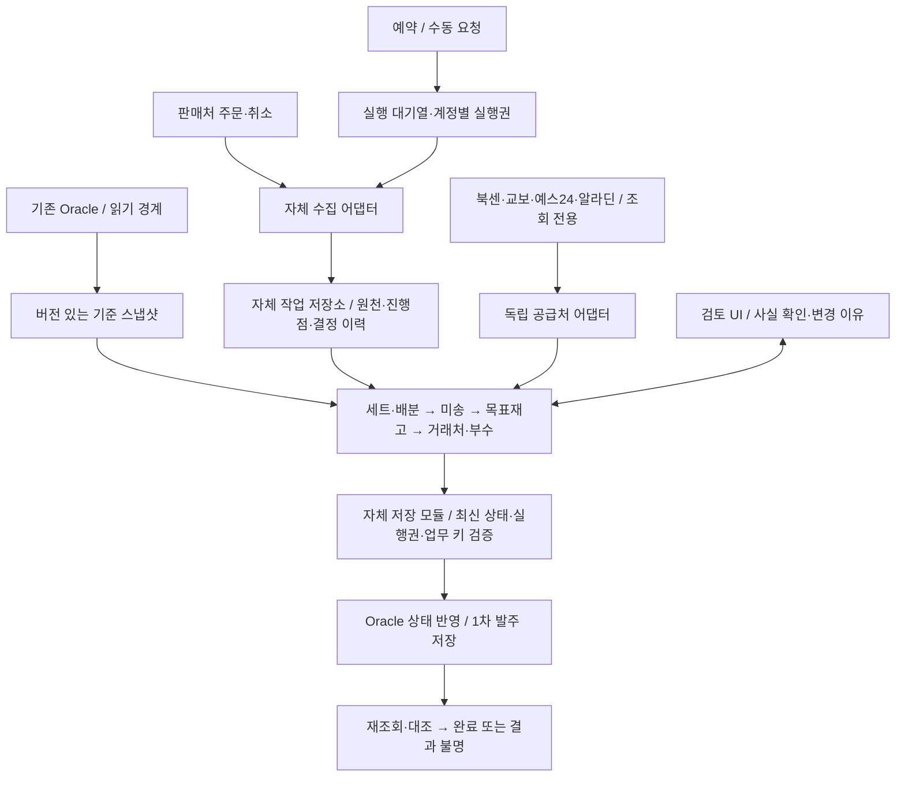

# 제이북스 발주자동화 · 기획 통합본

**v1.1 · 실프로그램 검증을 통합한 설계 기준 · 2026.09.20**

주문·취소 수집부터 거래처·부수의 1차 저장까지. 업무 규칙, 시스템 경계, 검증과 현장 조사 계획을 한 문서로 연결한다.

**문서의 완료와 제품의 완료는 다르다.** 이 문서는 구현 착수에 필요한 기획을 정리한 기준안이다. 고객사 DB 조사, 수집 경로 검증, 계수 보정과 운영 시험은 아직 수행하지 않았다. 정책 수치와 기술 선택은 아래 결정 조건에 따라 확정한다.

## 01. 범위와 요구사항 추적

**완료 경계:** 기준시각의 필수 주문·취소를 대조하고, 세트·재고·미송과 거래 조건을 계산하여 **제이북스에 실제 거래처·부수를 1차 발주 상태로 저장한 뒤 재조회로 확인**한다. ‘크롤링’ 임시 지정만으로 완료 처리하지 않는다. 확인할 행이 남으면 부분 완료다.

| 요구 | 구현 책임 / 검토 위치 | 운영 수용 기준 |
|---|---|---|
| FR-01 예약·수동 실행 | M01 / 수집센터 | 같은 모듈·대기열, 실행 범위 명시 |
| FR-02 주문·취소 반영 | M02 / 계정별 상태 | 중복·부분취소·역순·누락 대조 |
| FR-03 세트·낱권 | M04 / 상품 상세 | 수요·수불 보존, 공유 재고 한 번 배분 |
| FR-04 미송 | M05 / 미송관리 | 원발주 잔량·입고시점으로 판정 |
| FR-05 적정재고 | M04 / 산식 근거 | 3주+이전 이력, 당시 정보로 검증 |
| FR-06 조회 대상 | M07 / 선정 이유 | 65 후보·예외·최신성 정책 추적 |
| FR-07 공급처 조회 | M06 / 비교 결과 | 4개 독립 경로, 실패와 품절 구분 |
| FR-08 거래처·부수 | M07 / 발주 검토 | 납기·부수·합산 조건까지 재검증 |
| FR-09 1차 저장 | M08 / 저장 결과 | 기존 화면과 거래처·수량·상태 일치 |
| FR-10 예외 확인 | M09 / 확인 목록 | 사유·근거·해결 행동 연결 |
| FR-11 복구·동시성 | M01·M08 / 이력 | 재실행·수정 시 중복 및 덮어쓰기 방지 |
| FR-12 성과 보고 | M09 / 오전 현황 | 자동·수동 보조·보류·시간 분리 |

**P0 제외:** 공급처 주문 전송·장바구니 변경·결제, 도매 매입 후 반품/직거래 재매입, 손실 상품의 고객 주문 자동 취소. 기존 코드와 업무 함수를 재사용하지 않고 자체 구현한다. DB 제약·트리거·채번 규칙은 반드시 조사한다.

**설계 우선순위:** PRD v0.5의 기능·테스트와 이 문서의 운영 계약을 함께 적용한다. 화면 시제품은 대표 흐름을 보여주는 예시이며 정책의 원본이 아니다. 정책 변경은 버전과 영향 테스트를 함께 갱신한다.

## 02. 아키텍처와 데이터 책임



**구조 제안:** 기능별 모듈을 가진 웹 애플리케이션, 작업 워커, 내구성 있는 작업 저장소를 사용한다. 운영 Oracle은 상품·수불·기존 발주의 기준이며 자체 저장소는 원천 수집 근거·실행 상태·정책·판단 이력을 관리한다. 운영 DB와 자체 저장소에 동일 사실을 따로 고쳐 두 개의 정답을 만들지 않는다.

수집 중 네트워크 요청을 Oracle 쓰기 트랜잭션 안에서 기다리지 않는다. 원천 보관 → 정규화 → 검증된 반영 → 반영 대조를 구분한다. 두 저장소를 가로지르는 원자성을 가정하지 않는다. 기록이 엇갈리면 운영 키를 조회하여 조정한다.

**배포 선택 조건:** 전용 실행 환경을 우선 검토한다. 기존 서버에 함께 설치하려면 최대 주문량·조회 동시성·메모리/CPU 부하 시험을 통과해야 한다. 32GB 중 약 18GB 사용이라는 고객 제공 수치만으로 VM 할당량이나 여유 용량을 확정하지 않는다. Oracle 11g의 정확한 버전 확인 후 런타임·드라이버·인코딩을 시험한다.

저장 모듈은 주문/취소 상태, 검증된 세트 수불, 1차 발주를 구분된 업무 단위로 처리한다. 1차 저장이 트리거나 배치로 외부 전송을 유발하면 현재 경계로 쓰기를 열 수 없다. 전송과 분리 가능한 상태·객체를 먼저 확인한다.

**실프로그램 반영:** 원천 오류 보존 → 주문/취소 수신 → 내부 상태 대조·반영 → 재조회 확인을 구분한다. 거래처 마스터의 유효기간·입고 시일·마감·법인과 실제 발주 회차를 Oracle 읽기 계약에 포함한다. UI 컨트롤 이름은 실제 DB 객체명이 아니다.

## 03. 예약·수동 수집의 실행 계약

예약과 ‘지금 수집’은 **같은 실행 경로**를 사용한다. 시간대는 Asia/Seoul이며 예약별 요일·시각 또는 간격, 대상 계정, 후속 처리, 활성 상태와 버전을 보관한다. 실제 시각은 현장 확인 후 설정한다.

| 기록 | 필수 필드 / 판정 |
|---|---|
| 요청 | request_id, 요청자/예약, 대상 계정, 기간/증분, 수집만/1차 발주까지 |
| 예약 발생 | schedule_id + 예정시각을 안정 키로 사용; 재기동 중복 발생 차단 |
| 계정 작업 | 계정·주문/취소 범위, 상한 기준시각, 커서, 시도 횟수, 완료/실패 원인 |
| 원천 이벤트 | 판매처·계정·원주문·행·이벤트 종류·원천 버전; 원응답 근거 연결 |
| 계획 기준 | 필수 계정 목록 버전, 모두 확인된 기준시각, 입력 스냅샷·정책 버전 |

계정별 실행권으로 중복 반영을 막는다. 진행 중인 작업이 완전히 포함하는 요청만 연결하고, 더 늦은 종료시각이나 다른 범위는 후속 작업으로 남긴다. 수집만 요청을 ‘1차 발주까지’로 몰래 확대하지 않는다. 예약 일시중지는 수동 실행을 막지 않으며 실행 중지와 별개다.

**진행점:** 원천 조회 성공만으로 커서를 전진시키지 않는다. 정규화·필요한 상태 반영·대조가 끝난 범위만 성공으로 표시한다. 과거 기간 재수집은 현재 증분 진행점을 후퇴시키지 않는다. 주문·취소 커서는 각각 추적한다. 변경일 조회, 겹치는 구간 재조회, 정기 대조 범위는 원천 계약에 맞춘다.

**이벤트 순서:** 취소가 주문보다 먼저 왔으면 원주문 조회 또는 대기 상태로 연결한다. 단순 수신시각으로 최신 상태를 결정하지 않는다. 원천 버전이 없다면 상태 스냅샷·변경시각·대조 방식으로 계약을 보완한다. 안정적인 행 식별이나 완전성을 확보하지 못한 경로는 자동 반영 대상으로 승격하지 않는다.

필수 계정 하나가 실패했고 영향 범위를 모르면 전체 자동 저장을 보류한다. 부분 자동 처리는 영향 계정·상품·재고 풀이 독립임을 증명한 범위에서만 허용한다. 서버 재시작 후 누락 예약은 마지막 성공 범위부터 통합 수집하며, 지난 발주 회차로 자동 저장하지 않는다.

**실화면 확인 E02·E03:** 10개 그룹·27개 계정 표시가 있다. 활성 여부는 미확인이다. 장애주문 보정·재처리와 취소수집/취소처리(F7)를 분리한다. 몰과 제이북스 상태가 충돌하면 수신 성공이어도 반영 완료로 집계하지 않는다. ‘출고중 → 미출고’를 자동 복구에 포함하지 않는다.

## 04. 적정재고와 거래처 결정 순서

**시험 산식:** 최근 완료된 21일을 최근순 W1/W2/W3으로 나누고, 그 이전 84일과 혼합한다. 아래 계수는 고객 데이터로 검증할 시작 후보다.

```text
d21 = (0.5×W1 + 0.3×W2 + 0.2×W3) / 7
d   = 0.7×d21 + 0.3×d_old
S   = ceil(d×H + SS_H)
Q   = max(0, B + S - I - P_valid)
```

H는 다음 발주 기회에 낸 물량이 사용 가능한 재고로 들어올 때까지다. SS는 같은 H의 과거 과소예측 오차 분위수로 시험한다. B는 현재 확정 미출고, I는 B 예약을 아직 차감하지 않은 물리 재고, P_valid는 필요한 시점까지 도착이 확인된 기존 공급이다. 상세 예외와 예시는 PRD Q03\~Q09에 따른다.

**DEC-01 · 0부 조기 종료를 제한한다.** L04의 기준 거래처 계산은 잠정값이다. 현재 정책과 거래처 조건이 유효하고 그 보호기간의 수요·공급이 모두 충족될 때만 ‘발주 없음’으로 끝낸다. 기존 거래처 조건이 무효·미확인이면 0이라는 값만으로 L05\~L07을 생략하지 않는다. 대체 거래처의 H·SS·S·Q를 평가한다. 이미 유효한 무발주 정책을 두고 더 느린 거래처를 가정해 불필요한 재고를 만들지도 않는다.

**DEC-02 · 후보별 부수와 조건을 함께 비교한다.** 후보의 판본·계정 → 달력/납기 → H·SS·S·Q → MOQ/포장·과잉 상한 → 부수별 견적/공급 → 거래처별 합산 조건 순으로 계산한다. 부수 구간이 납기나 단가를 바꾸면 해당 후보를 다시 평가한다. 유한한 견적 구간을 열거하며, 조건이 계속 바뀌거나 불명확하면 자동 확정을 보류한다.

배송비는 상품 하나마다 무료배송을 가정하지 않는다. **거래처×계정×배송/입고 묶음**으로 전체 계획을 대조한다. 묶음 기준을 모르면 배송비 조건 미확인으로 표시한다. 선택안의 최종 합산 금액·부수가 모든 조건을 만족해야 저장 가능하다. 전 상품 전역 최저가 최적화는 P0 필수 범위가 아니다.

**대표 예시:** W1/W2/W3=14/7/7, d_old=1, H=3, SS=2이면 S=7. B/I/P=4/3/2이면 Q=6. 이는 가상 계산 예시이며 거래처 조건이나 적정재고의 고객 확정값이 아니다.

**입력 계약 E01·E05:** 온라인 7/14/21일이 같은 시점의 최근 누적임이 확인된 경우만 W1=C7, W2=C14-C7, W3=C21-C14로 변환한다. 원천 재집계와 대조하며 음수 차분을 임의 0 처리하지 않는다. 오프라인 출고와 주문의 중복을 제거하고 확정 재고 배분은 보호한다. 세트 3달 수주 조회는 21일 학습 기간과 분리하고 실제 적용 필터를 표시한다.

## 05. 미송·택배·익일 입고의 결합

거래 관계, 운송 방식, 입고기간, 잔량 정책은 서로 독립된 속성이다. ‘택배 업체’ 또는 ‘익일 업체’라는 한 분류로 미송 정책을 추정하지 않는다. 다음은 **10부 발주 중 6부 입고 후 잔량 4부**를 검토하는 예다.

| 경우 | 잔량·시점 상태 | 처리 원칙 |
|---|---|---|
| 당일 + 잔량 유지 | 필요일까지 4부 입고 확인 | 기존 공급으로 한 번 배분 |
| 당일 + 잔량 종료 | 업체의 잔량 종료 확인 | 최신 수요·재고로 신규 필요량 계산 |
| 익일 + 잔량 유지 | 내일 도착, 수요도 내일 | 내일 수요에 배분; 오늘 수요에는 사용 금지 |
| 익일 + 잔량 종료 | 기존 잔량 소멸 확인 | 신규 발주의 내일 납기도 다시 검증 |
| 택배 + 유지 | 도착일 불명 또는 필요일 이후 | 정시 공급 제외, 중복 발주 보호와 확인 유지 |
| 정책/입고 매칭 불명 | 연속 발주·부분입고 혼재 | 원발주 행 확인 전 임의 소진·재발주 금지 |

**수량 보존:** 원발주별 유효 주문량 = 누적 입고 반영량 + 미입고 취소/종료량 + 열린 잔량으로 대조한다. 입고 취소·정정은 원기록과 연결하고, 반품이 원발주 잔량을 자동으로 다시 여는지는 별도 계약으로 확인한다. 검수 불량/사용 불가 재고와 원발주 입고 완료량도 구분한다.

미송 확인 사실에는 업체·원발주행·확인 수량·예정일·확인시각·방법·담당자·근거·유효기간을 둔다. ‘다음에도 알아서 들어온다’는 업체 기본 정책보다 해당 원발주의 최신 확인을 우선하되, 서로 모순되면 보류한다. 입고예정 확인은 실물 재고 증가가 아니다.

오늘 부족하지만 늦게 들어오는 유지 미송이 있으면 자동으로 다른 업체에 같은 4부를 내지 않는다. 기존 잔량 종료 또는 의도적 이중 확보의 수량·처리 방안을 사람이 결정한 변경 계획이 있어야 한다. 문의 지연 며칠이라는 경과시간만으로 잔량이 사라졌다고 판정하지 않는다.

재고·미송은 낱권·판본·창고/재고 풀·필요일로 배분한다. 완성 세트와 조립 가능한 낱권이 겹치거나 두 세트가 구성품을 공유해도 동일 재고·공급을 한 번만 사용한다. 배분 정책의 동률은 원수요 키 등 안정적인 순서로 처리하고, 고객 납기 우선순위는 현장 계약으로 확정한다.

**마스터와 미송 E04·E06:** 기존 주문유효기간·입고 시일·마감시간·발주방식·법인을 우선 매핑한다. 유효기간 만료는 미송 소멸의 증거가 아니며 전송 방식은 운송 방식이 아니다. 화면에서 발주·입고 이력이 함께 보여도 원발주-부분입고 연결은 미확인이다. 정책 값의 의미·품질과 10/6/4 실사례를 DB에서 대조해야 한다.

## 06. 저장된 발주와 다음 실행의 관계

**DEC-03 · 저장은 새 행 추가가 아니라 업무 의도의 버전 관리다.** 실행 ID가 달라졌다는 이유로 같은 수요를 다시 발주하지 않는다. 고객 주문 보충과 적정재고 보충 모두 미종결 계획을 함께 대조한다.

| 단계 | 논리 상태 | 허용되는 후속 행동 |
|---|---|---|
| 계산 중 | DRAFT / HOLD / READY | 입력 변화 시 재계산, 보류 해결 |
| 저장 시도 | APPLYING | 실행권·입력 버전·기존 키 검증 |
| 응답 불명 | UNKNOWN | 업무 키 조회·대조; 무조건 재삽입 금지 |
| 대조 완료 | SAVED | 운영 키·저장 버전 확정 |
| 변경 발생 | REVISION_REQUIRED | 기존 상태 확인 후 변경 계획 생성 |
| 외부 전송/잠금 발견 | LOCKED_REVIEW | 자동 수정하지 않고 담당자 검토 |

안정적인 `intent_id`와 증가하는 `revision`을 둔다. `run_id`는 시도 이력일 뿐 발주의 유일 키가 아니다. 거래처·회차·수량이 바뀌어도 같은 의도의 변경은 원 의도와 연결한다. 수요 배분 키, 재고 보충 계획의 소유 범위, 기존 운영 키를 함께 관리한다. 단순히 ISBN+날짜로 유일성을 정하지 않는다.

**기존 1차 저장은 공급 확정과 다르다.** 미전송 초안은 별도 계획 약정량으로 관리한다. 재계산할 때 자기 초안을 확정 P_valid에 넣어 Q를 0으로 만들지 않는다. 실제 재고·확정 공급 기준으로 필요한 총 계획을 구하고, 동일 범위의 미종결 초안과 비교하여 유지/수정/철회 후보를 만든다. 다른 실행이 이미 맡은 수요와 보충량까지 합쳐 중복 계획을 막는다.

예를 들어 6부를 저장한 뒤 입력이 같으면 기존 6부를 유지한다. 취소로 필요량이 4부가 되면 미전송·미잠금 상태에서 기존 계획을 4부로 바꾸는 변경안이 된다. 이미 전송됐으면 새 4부 발주나 자동 취소가 아니라 검토 대상이다. 취소 후 재계산도 MOQ·배송 묶음과 수동 잠금을 다시 검증한다.

**Oracle 반영 계약:** 가능한 경우 업무 키/변경 버전을 운영 반영과 같은 트랜잭션에서 내구성 있게 기록하고 유일성을 보장한다. 지원 객체를 추가할 수 있는지는 DB 조사 항목이다. 키를 원자적으로 남길 수 없고 기존 결과를 유일하게 식별할 수도 없다면 ‘정확히 한 번 저장’을 약속하지 않는다. 불명 결과 자동 재시도는 금지하고 해당 경로는 운영 자동 저장 개방 조건을 충족하지 못한 것으로 처리한다.

**회차·수정 경로 E07·E08:** 08·10·11·12·14·16·17·18 등의 발주 타임이 있다. 10/18로 고정하지 않고 실제 업무 키로 다룬다. 발주업무 F7뿐 아니라 상세의 일괄 수정·복사 등 모든 변경 경로를 조사해 동시 수정과 커밋 경계를 확인한다. 이번에는 지정 회차 5개 행의 존재만 확인했으며 저장은 시험하지 않았다.

## 07. 정책 설정과 사람의 수정

**DEC-04 · 사실, 정책, 수동 예외를 분리한다.** 입고 6부라는 사실과 ‘다음날 다시 주문’이라는 정책을 같은 필드에 넣지 않는다. 정책은 초안 → 과거 재현 → 검토 → 활성의 버전을 갖는다. 실행 시작 시 적용 버전을 고정하고 변경 이력을 남긴다.

| 정책 묶음 | 설정 값 | 확정 근거 |
|---|---|---|
| 수집 | 계정, 시각/간격, 재조회 구간, 후속 처리 | 실제 수집 이력·원천 계약 |
| 재고 | 적용 유형, W 가중치, 이전 기간, λ, SS 표본/분위수, 상한 | 시점 재현·보유재고/결품 평가 |
| 거래처 | 직거래/도매, 마감·달력·납기, MOQ·배송 묶음·반품 | 실제 발주/입고 + 최신 계약 |
| 미송 | 유지/종료 기본값, 확인 유효기간, 지연 확인 기준 | 원발주별 결과·업체 확인 |
| 크롤링 | 공급률 정규화, 65 후보, 상품/출판사 예외, 견적 유효기간 | DB 값·당시 선택·원천 견적 |
| 변경·저장 | 수동 잠금, 회차 이동, 초안 수정, 허용 저장 범위 | 운영 상태/전송 경계 조사 |

수동 수정은 **원 값·새 값·사유·근거·작성자·시각·적용 범위·만료/해제 조건**을 기록한다. 다음 자동 실행은 잠금 값을 덮어쓰지 않는다. 새 취소·입고로 수정안의 전제가 바뀌면 ‘재검토 필요’로 전환한다. 잠금은 오래된 입력을 그대로 저장할 권한이 아니다.

권한은 역할 이름보다 행동으로 정의한다. 조회, 수집 실행, 예약 변경, 사실 확인, 수량/거래처 수정, 정책 활성화, 운영 저장 개방을 나눈다. 고객의 인원·업무 분장을 확인해 사용자에게 배정하며 임의로 2인 승인 절차를 요구하지 않는다. 인증 정보는 서버 측 자격증명 저장소에 두고 문서·브라우저·실행 로그에 노출하지 않는다.

부정확한 계수를 자동 학습 결과로 고정하지 않는다. 과거의 수동 변경은 이유를 검토할 자료이며, 한 상품의 변경을 모든 출판사·거래처에 즉시 일반화하지 않는다. 같은 우선순위의 정책이 충돌하면 숨겨진 등록 순서로 선택하지 않고 정책 충돌을 표시한다.

## 08. 장애 복구와 운영 개방

| 장애 / 변경 | 즉시 처리 | 재개 기준 |
|---|---|---|
| 판매처 인증·조회 실패 | 계정 실패·영향 범위 표시 | 인증 복구 후 누락 범위 대조 |
| 공급처 조회 누락 | 품절로 바꾸지 않고 보류 | 재조회 또는 승인된 제외 정책 |
| 실행권 만료 후 구 워커 복귀 | 새 소유자의 실행을 보호 | 쓰기 단계에서 현재 토큰/버전 재검증 |
| Oracle 반영 중 응답 유실 | UNKNOWN, 해당 의도 재저장 차단 | 운영 키로 실제 커밋 결과 확인 |
| 10행 중 일부 반영 | 성공/실패/불명 행을 따로 보관 | 성공은 반복하지 않고 남은 행만 처리 |
| 수동 수정·새 취소·입고 | 영향 계획 저장 중지 | 버전 대조 후 변경 계획 재계산 |
| 오래된 견적·마감 경과 | 납기·조건 효력 재평가 | 새 견적/다음 회차 정책 확인 |

실행권 만료 시간만으로 안전을 보장하지 않는다. 재개한 오래된 워커가 쓰지 못하도록 쓰기 경계에서 현재 실행권을 검증하는 토큰/잠금 계약이 필요하다. 외부 호출 재시도는 제한 횟수·지연·호출 제한을 적용하며, 불명 쓰기는 읽기 대조를 우선한다.

**관측 항목:** 계정별 마지막 성공, 대기열 지연, 누락 범위, 필수 계정 완전성, 견적 최신성, 보류 수량·사유, 미대조 저장, 실행권 충돌, 실제 작업시간. 업무 마감에 영향을 주는 실패·결과 불명·확인 필요 건을 담당자가 찾을 수 있어야 한다.

**개방 순서:** 읽기 전용 표본 → 과거 재현 → 시험 DB 반영/복구 → 운영 읽기 기반 병행 비교 → 제한된 자동 저장 → 범위 확대. 각 단계의 증거가 확보된 뒤 다음 권한을 연다. 기존 업무와 병행 비교할 때 새 도구는 계산 결과만 기록해 이중 반영을 피한다.

**중단·되돌림:** 새 작업 발생과 신규 쓰기를 중지하고, 진행 중 단위의 결과를 확정·대조한다. 프로그램 버전을 되돌려도 이미 커밋된 주문·수불·발주는 사라지지 않는다. 변경 내역별 보정 계획이 필요하다. NOARCHIVELOG라는 제공 정보만으로 복구 가능 범위를 추정하지 않고 실제 백업·복원 시험 결과를 확인한다.

## 09. 검증 계획과 성공 판정

**검증 수준을 구분한다.** 시제품의 가상 수집·반영 대기·예시 계산·저장 시나리오 검사는 화면·예시 계산·가상 수집/저장에 대한 검사다. PRD의 운영 수용 테스트를 통과했다는 의미가 아니다. 아래 보강 사례를 포함해 PRD v0.5는 **48개 계획된 수용 테스트**를 갖는다.

| 추가 테스트 | 입력 사례 | 반드시 확인할 결과 |
|---|---|---|
| AT-32 | 기준 거래처 잠정 Q=0, 조건 만료·대체 납기 변경 | 0부 조기 종료 없이 후보 정책 재평가 |
| AT-33 | 6부 저장 후 같은 입력으로 새 실행, 이후 필요 4부 | 6부 중복 없음; 미전송 초안 변경안 4부 |
| AT-34 | 여러 상품의 배송비 합산·MOQ 구간 변화 | 전체 선택안의 합산 조건 재검증 |
| AT-35 | 실행권 만료 후 구 워커가 쓰기 재개 | 현재 소유권 없는 쓰기 차단 |
| AT-36 | 여러 반영 단위 중 커밋 성공과 응답 유실 혼재 | 성공·불명 구분, 조회 후 남은 단위만 처리 |
| AT-37 | 저장된 발주가 전송된 뒤 고객 취소 도착 | 자동 재발주·수정 대신 상태 충돌 검토 |
| AT-38 | 수동 잠금 후 입력·정책 변경, 사실 유효기간 만료 | 덮어쓰기 방지 및 재검토 상태 전환 |

**평가 데이터:** 저회전/반복 판매/급증, 세트 공유 구성품, 당일·익일·택배, 미송 유지·종료·불명, 휴일·마감, 부분취소·역순·응답 유실을 포함한다. 각 사례에 당시 원천·DB 스냅샷·기대 결과·판정자를 연결한다. 대표적인 오전 회차와 예외가 포함될 때까지 표본을 확보하며 임의로 며칠이면 충분하다고 단정하지 않는다.

**정확성 통과 조건:** 중복 반영·누락·수량 보존 위반·금지된 외부 전송은 시험에서 0건이어야 한다. 모든 입력 행은 저장·보류·발주 없음 등 하나의 추적 가능한 결과를 갖는다. 고의 오류 주입과 재시작에서도 같은 조건을 만족해야 한다.

**성과 측정:** 동일 범위의 실제 오전 업무에서 사람의 조작/확인 시간과 단순 대기시간을 따로 기록한다. 자동화 후 예외 처리·수동 파일·수정·재작업 시간까지 합산하여 기준선과 비교한다. ‘2시간 절감’은 목표이며 보장치가 아니다. 자동 완료율은 기준시각 발주 필요 대상 중 사람 개입 없이 저장·대조한 비율로, 분모와 제외 사유를 고정한다.

산식은 21일 단순평균·최근 주 가중평균·이전 이력 혼합을 같은 과거 시점에서 비교한다. 수요 오차뿐 아니라 필요일 미충족 부수·재고 체류·수정 사유를 함께 본다. 마지막 평가 구간은 계수 튜닝에 쓰지 않는다.

## 10. 현장에서 확정할 결정 목록

아래 항목은 같은 질문을 반복하는 설문이 아니다. **동일 주문·상품·원발주의 DB와 원천 증거를 먼저 연결**하고, 기록으로 설명되지 않는 부분만 담당자에게 확인한다. 고객 업무 담당, DB 담당, 개발 담당은 역할 제안이며 실제 사람은 현장에서 배정한다.

| ID | 확보할 증거 | 결정 / 담당 역할 |
|---|---|---|
| D01 수집 | 활성 계정·수집 이력·부분/늦은 취소 원응답 | 실행 시각·완전성 / 업무+개발 |
| D02 재고 | 총량/예약/가용 정의와 당시 주문·변경 기록 | B/I/S 의미·산식 입력 / DB+업무 |
| D03 세트 | 겹치는 세트 두 개의 구성표·수불 전후 | 배분·조립·취소 계약 / DB+업무 |
| D04 미송 | 10/6/4 및 연속 발주-부분입고 매칭 | 잔량·예정일·반품/정정 / 업무+DB |
| D05 조회 대상 | 공급률 원값·예외 거래처·선택 결과 | 65 단위·예외 우선순위 / 업무+개발 |
| D06 네 공급처 | 계정 권한·조회/파일 샘플·오류 응답 | 독립 수집 방식·자동 범위 / 개발 |
| D07 거래 조건 | 부수별 견적·배송/입고 합산·MOQ·반품 | 후보 재계산·묶음 정책 / 업무 |
| D08 달력 | 회차 코드·요일·휴일·마감 전후 표본 | H·회차 이월 / 업무+개발 |
| D09 저장 | 채번·키·트리거·전송·잠금·수정 경로 | 멱등 저장·초안 변경 / DB+개발 |
| D10 환경 | 정확한 버전·권한·시험 DB·복원 결과 | 런타임·배포·복구 / DB+개발 |

**표본 한 건의 기록 묶음:** 비식별 사례 ID, 화면 시각, 원천 주문/행 참조, DB 행 참조, 상태 전후, 기대 수량, 실제 선택, 차이 이유, 아직 모르는 사항, 증거 위치, 결정자와 결정일. 연결 키가 빠진 스크린샷만으로 저장 계약을 확정하지 않는다.

**우선순위:** D01\~D03으로 주문·취소의 읽기 계약부터 확보한다. D04\~D08로 판단 엔진을 보정하고, D09\~D10의 시험 저장·복구 경계를 통과하기 전 운영 쓰기를 열지 않는다. 전화 확인·당일 견적·기록되지 않은 판단 이유는 DB만으로 답이 나오지 않을 수 있다.

현장 기록지는 v1.1의 12페이지 HTML/PDF를 사용한다. 이 결정 목록과 같은 사례 ID를 기록하면 현장 기록 → 정책 결정 → 요구사항 → 테스트를 연결할 수 있다. 원본 개인정보·접속정보를 고객 전달용 보고서나 노션에 넣지 않는다.

## 11. 착수 순서와 문서 사용법

| 단계 | 산출물 | 다음 단계로 넘어갈 증거 |
|---|---|---|
| A 데이터 계약 | 실제 객체 관계·정규화·단위·상태·샘플 | DB-01\~09 대조 결과 |
| B 독립 계산 | 수집·세트·미송·재고·조회·후보 엔진 | 당시 상태 재현, 예외 설명 가능 |
| C 시험 반영 | 저장·변경·대조·재시작·복구 모듈 | 48개 수용 테스트와 환경 시험 |
| D 제한 운영 | 지정 계정·상품군·회차의 저장 개방 | 정확성 및 실제 오전 작업시간 측정 |
| E 확대 판단 | 예외·효과·운용 부담 보고 | 고객의 확대 범위 결정 |

화면설계 문서의 W01\~W10을 이 단계에 연결해 구현한다. 각 작업은 입력 계약, 코드, 오류/복구 시험, 검토를 포함하여 산정한다. 일정·비용은 활성 판매처/계정 수, 조회 경로, 세트/미송 예외, 저장 객체 수와 시험 환경을 확인한 뒤 제시한다. 현재는 근거 없는 개발 주수나 완료일을 약속하지 않는다.

**현재 준비된 것:** 영상 3편의 자동 전사·표본 화면 근거, PRD/로직보드, 재고 산식 초안, 5개 화면 시제품, 모듈·작업 계획, 현장 조사 기록지, 이 운영 계약과 검증 계획. 자료를 요구사항·화면·시험에 연결하는 기획은 작성했다.

**아직 증명하지 않은 것:** 실제 DB 구조·저장/전송 경계, 네 공급처의 독립 수집 가능성, 고객 데이터로 보정한 계수, 운영 성능·복구·2시간 절감. 이것들은 개발 착수/운영 개방 조건으로 남아 있으며 기획 문서를 만들었다는 이유로 통과 처리하지 않는다.

권장 열람 순서는 통합본 → PRD v0.5 → 화면 시제품 → 화면설계·구현계획 → 현장 기록지다. `index.html`에서 최신 자료에 접근한다. 기존 PRD v0.1부터 v0.4, 통합본 v1.0과 예전 ZIP은 당시 기록이며 최신 기준으로 혼용하지 않는다.

**출처:** 고객 요구사항, 노션 ‘제이북스 발주자동화’, 2026.09.17 현장 영상 3편(총 95분 12초), 재기획 v4, PRD v0.5 및 화면설계 v0.2을 대조했다. 영상 전체 자동 전사와 표본 화면 분석이며 전체 사람이 교정한 전사·전 프레임 검수는 아니다. 핵심 구간은 PRD 15절에 연결되어 있다.

**v1.0 설계 보강:** DEC-01 0부 종료 조건, DEC-02 후보/배송 합산 재검증, DEC-03 저장 의도와 변경 버전, DEC-04 정책·수동 수정의 효력을 명시했다. 이 문서의 논리 필드와 상태명은 실제 Oracle 객체를 조사해 확정할 구현 계약이다.


## 12. 실프로그램 확인과 수용 기준 연결

2026.09.20 JBOOKS v1.0.0.94의 업무 화면 7종에서 확인한 구조를 설계 본문에 통합했다. 제한 조회로 매입처 검색 결과와 한 회차 5개 행을 확인했으며, 수집·취소처리·저장·재고 변경은 실행하지 않았다. 셀 값이 노출되지 않는 항목은 수량·가격 검증에 쓰지 않았다.

| 근거 | 확인한 구조 | 반영 위치 / 후속 시험 |
|---|---|---|
| E01 발주업무 | 온라인 7/14/21, 오프라인 7/14/21/28 | PRD Q04-A / AT-42·47 |
| E02 주문수집 | 27개 계정 표시와 장애주문 보정 | COL-05 / AT-39·41 |
| E03 취소주문수집 | 수신·상태 대조·취소처리 분리 | COL-05 / AT-40 |
| E04 미입고 | 발주일·입고일과 각 이력 | B06 / AT-43 |
| E05 세트 | 3달 수주, 다른 조건 무시 안내 | Q04-A / AT-46 |
| E06 매입처 | 유효기간·입고 시일·마감·전송 방식·법인 | B06 / AT-43·44 |
| E07·E08 상세 | 여러 회차, 조회 5개 행, 일괄 수정 경로 | 저장 계약 / AT-45·48 |

검증 보고서의 LV-01부터 LV-10은 PRD AT-39부터 AT-48로 순서대로 편입했다. 기존 AT-01부터 AT-38과 합쳐 **48개 운영 수용 테스트 계획**이며, 실제 운영 시험 합격 건수가 아니다.

**표시와 사용을 구분한다.** 판매처 10개 그룹·계정 표시 27개는 화면 구성이다. 활성·법인·권한·수집 성공 여부는 계정 원장 조사로 확인한다. 실제 전체 목록은 PRD COL-05, 시제품의 화면 관찰 참고표에서 볼 수 있다. 시제품에서 조작하는 계정은 3개의 가상 계정이다.

**아직 확인하지 못한 것:** 취소 반영과 실제 수요 변경 시점, 집계 열의 누적 의미, 원발주-부분입고 연결, 거래처 정책 값의 품질, 모든 수정 경로의 트랜잭션, 독립 수집 가능성. 필드가 있다는 사실을 규칙이 검증됐다는 뜻으로 해석하지 않는다.

## 13. 자료 기준과 서버 정보

| 자료 | 이번 기준 | 역할 |
|---|---|---|
| 기획 통합본 | v1.1 / HTML·PDF·MD | 범위·아키텍처·운영 계약·착수 기준 |
| PRD·로직보드 | v0.5 / HTML·MD | 12개 기능·48개 운영 수용 테스트 계획 |
| 화면설계·구현계획 | v0.2 / HTML·MD | 5개 화면·9개 모듈·10개 작업 묶음 |
| 화면 시제품 | v0.2 / 오프라인 HTML | 가상 수집·취소 반영 대기·회차·산식 검토 |
| 현장 기록지 | v1.1 / HTML·PDF | DB와 원천을 먼저 대조하고 남은 의미를 인터뷰 |
| 실프로그램 검증 | 2026.09.20 관찰 기록 | E01부터 E08의 확인 범위와 한계 보존 |
| 영상·전사·기존 문서 | 이전 근거 자료 | 원본을 수정하지 않고 최신 설계와 구분 |

**서버 환경은 고객 제공 정보다.** IDC의 Windows Server 2019 Standard, 4C/8T, RAM 32GB, Oracle 11g, KO16MSWIN949, NOARCHIVELOG. C:는 Oracle 전용, D: 여유 약 931GB, Windows+Oracle 사용 약 18GB라는 당시 제공치다. 현재 값·정확한 패치·복원 가능 범위는 이번 열람으로 재확인하지 않았다.

기존 한글 문자셋과 신규 도구의 유니코드 데이터를 경계에서 검증한다. 지원되지 않는 문자를 조용히 손실 변환하지 않고 보존·보류 규칙을 정한다. NOARCHIVELOG 상태의 복구는 실제 백업 방식과 복원 시험으로 판단하며, 읽기 조사·시험 저장·운영 적용의 접근 범위는 고객 내부 절차로 확정한다. 서버 주소·자격증명은 전달 자료에 싣지 않는다.

고객 전달은 v1.1 ZIP을 풀고 index.html부터 시작한다. 이 파일은 최신 설계와 관찰 기록을 구분해 연결한다. 이전 ZIP·보고서·영상은 과거 기록으로 보존하며, 새 전달 묶음에는 최신 설계와 필요한 비식별 관찰 기록만 넣는다.
