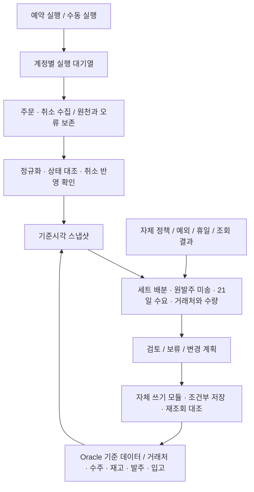

# 제이북스 실프로그램 기반 계획 검증

2026.09.20 · JBOOKS v1.0.0.94 · 기획 통합본 v1.0 / PRD v0.4 보완 문서

## 01. 검증 결론과 적용 범위

**자동화 범위는 유지하되, 수집·취소 반영·미송 판정·저장 계약을 실제 화면 구조에 맞춰 보강한다.** 예약 및 수동으로 주문·취소를 수집하고, 자체 코드로 거래처와 부수를 정해 1차 발주를 저장한다. 공급처에 실제 발주를 전송하는 단계는 기존 범위대로 제외한다.

실행 중인 프로그램에서 업무 화면 7종을 확인했다. 매입처명을 한정한 조회와 발주 타임 `2026.09.18 (금) - 16` 조회를 수행했고, 후자는 5개 행을 반환했다. 화면에 접근성 텍스트로 노출되지 않는 셀 값은 수량 검증 근거로 사용하지 않았다.

| 판단 | 이번에 확인한 근거 | 계획 반영 |
|---|---|---|
| 유지 | 주문수집·취소주문수집·발주업무가 분리 | 단계별 성공·실패와 재실행을 독립 관리 |
| 보강 | 판매처 10개 그룹, 계정 표시 27개 | 판매처가 아닌 계정 단위 실행·완료 판정 |
| 보강 | 취소수집과 취소처리(F7)가 별도 | 수집 완료와 내부 수요 반영 완료를 분리 |
| 보강 | 온라인 7·14·21일, 오프라인 7·14·21·28일 | 원천·기간·취소 차감 기준을 정한 뒤 산식 연결 |
| 보강 | 거래처 마스터에 유효기간·입고 시일·마감시간 | 기존 데이터의 의미·품질부터 확인하고 매핑 |
| 보강 | 발주 타임에 08·10·11·12·14·16·17·18 표시 | 10/18 두 회차로 고정하지 않는 실행 키 |
| 보류 | 발주·입고 이력은 보이나 원발주 매칭 미확인 | 미송 4부의 유지·소멸·재발주를 단정하지 않음 |
| 보류 | 저장·수정 조작은 실행하지 않음 | DB 쓰기 범위와 원자성 검증 전 운영 저장 금지 |

**검증 수준을 구분한다.** 화면 존재·필드·버튼·조회 결과 행 수는 관찰 사실이다. 필드 의미, 데이터 품질, 주문·입고 연결 키, 실제 저장 효과는 미확인이다. 아래 설계와 추가 테스트는 이번 관찰에 따른 제안이며, 운영 동작 시험에 합격했다는 뜻이 아니다.

현재 기획 기준은 기존 통합본 v1.0과 PRD v0.4에 이 검증 보완 문서를 함께 적용한다. 기존 PDF·ZIP·노션 본문·시제품의 일괄 개정이나 재검증은 이번 결과에 포함하지 않는다.

## 02. 수집 범위와 취소 처리 계약

주문수집 화면에는 계정별 다운로드 및 전체다운로드, 취소주문수집 화면에는 계정별 취소수집 및 전체 취소수집이 있다. 아래 27개는 **화면에 표시된 구성**이며, 실제 사용·로그인·수집 성공 여부를 확인한 계정 수가 아니다. 근거: E02·E03.

| 판매처 그룹 | 계정 표시 | 수 |
|---|---|---:|
| CJ 온스타일 | 1개 표시 | 1 |
| 11번가 | 제이북스 · 팝북 · 봄봄북스 · 온누리북스 | 4 |
| 스마트스토어 | 제이북스 · 팝북 · 봄봄북스 · 뿡뿡맘 | 4 |
| 쿠팡 | 제이북스 · 봄봄북스 · 온누리북스 · 다담 | 4 |
| 롯데아이몰 | 제이북스 · 팝북 · 봄봄북스 · 온누리북스 · 사이먼북스 | 5 |
| 롯데온 | 제이북스 | 1 |
| ESM | 제이북스 · 봄봄북스 | 2 |
| SSG | 제이북스 · 팝북 · 봄봄북스 · 온누리북스 | 4 |
| 패션플러스 | 제이북스 | 1 |
| 보리보리 | 제이북스 | 1 |

**예약·수동은 동일한 실행 대기열과 계정 잠금을 공유한다.** 운영 대상 계정, 주문/취소별 조회 범위, 기준시각, 재시도 정책을 실행 시작 시 고정한다. 화면에 남아 있는 미사용 계정은 조사 후 명시적으로 제외한다. ESM 화면 그룹만으로 하위 판매처의 주문번호 유일성이나 API 계약을 가정하지 않는다.

주문수집에는 **장애주문**과 상품코드·주문번호·순번 등을 보정하는 저장(F7)이 있다. 수집 오류를 버리지 않고 원천 기록, 보정 이력, 재처리 결과를 연결해야 한다. 임시 식별 키는 판매처·계정·주문번호·주문순번이며, 실제 유일성과 부분취소 단위는 DB 및 원천 명세로 확정한다.

취소 화면은 **몰 주문상태와 제이북스 주문상태**를 나란히 보여준다. ‘출고중 → 미출고’와 ‘취소처리(F7)’도 별도다. 따라서 `취소 수신 → 내부 상태 대조 → 반영 또는 충돌 보류 → 재조회 확인`을 분리한다. 출고 진행 건의 상태 되돌림을 일반적인 자동 재시도에 넣지 않는다. 반영 대기 취소가 수요에 남아 있는 상태에서 발주량을 확정하면 안 된다.

## 03. 3주 산식의 입력 계약

발주업무에는 온라인 판매량 추이 **7일·14일·21일·누적**, 오프라인 출고추이 **7일·14일·21일·28일**이 존재한다. 직전 발주와 발주 후 입고도 별도다. 기존 산식의 방향은 유지하지만 화면 열을 바로 W1·W2·W3에 대입하지 않는다. 근거: E01.

| 입력 계약 | 확인할 사항 | 잘못 연결하면 생기는 문제 |
|---|---|---|
| 기간 의미 | 최근 누적인지, 서로 겹치지 않는 구간인지 | 최근 1주 판매를 여러 번 반영 |
| 기준시각 | 집계 시각·일 경계·갱신 지연 | 주문수요와 판매 추이가 서로 다른 시점 |
| 순수요 | 취소·부분취소·반품·수정 반영 방식 | 취소량을 발주하거나 반품을 이중 차감 |
| 집계 단위 | 상품·ISBN·세트·구성품 변환 | 세트와 낱권 수요 중복 |
| 채널 범위 | 온라인 주문·오프라인 출고의 중복과 재고 공유 | 주문과 출고의 이중 계산 또는 재고 과배분 |

**최근 누적이며 동일한 기준시각·대상·순수량이라는 조건이 확인된 경우만** 아래 변환을 쓴다. 더 좋은 기본 경로는 주문 상세 이력에서 겹치지 않는 7일 구간을 직접 재집계하고 화면 집계와 대조하는 것이다.

```text
W1 = C7
W2 = C14 - C7
W3 = C21 - C14

d21 = (0.5 × W1 + 0.3 × W2 + 0.2 × W3) / 7
d   = 0.7 × d21 + 0.3 × d_old
S   = ceil(d × H + SS)
Q   = max(0, B + S - I - P_valid)
```

기존 정의를 유지한다. d_old는 최근 21일과 겹치지 않는 이전 84일의 일평균 수요, H는 다음 발주 기회의 입고까지 필요한 기간, SS는 과거 예측 오차에 따른 안전재고다. B는 확정 잔여 수요, I는 사용할 수 있는 재고, P_valid는 필요일까지 도착 가능한 유효 입고다. **계수와 기간은 초안이며 이번 조회로 보정·검증되지 않았다.** 기존 초안의 시간별 배분과 저장된 미전송 계획의 중복 방지도 계속 적용한다.

차분이 음수거나 집계 정의가 불일치하면 자동으로 0으로 덮지 않고 원천을 대조한다. 오프라인 예측을 별도로 할지 결정하더라도 이미 확정된 오프라인 주문·재고 예약은 공용 재고에서 보호해야 한다.

**세트 재고조정의 ‘수주기간 3달’은 21일 예측 기간과 다르다.** 해당 모드는 다른 검색 조건을 무시한다고 화면에 명시돼 있다. 새 도구에서는 유효한 필터와 무시되는 필터를 보여주고, 장기 미처리 수주와 예측 학습 기간을 분리한다. 근거: E05.

## 04. 거래처 정책과 미송 판단

매입처관리에는 이미 주문유효기간, 입고 시일, 발주 마감시간, 발주방식, 거래구분, 거래법인, 메모가 있다. 새 정책 관리 화면을 설계할 때 이 값을 우선 조사해 기본값으로 매핑하고, 부족한 예외·적용기간·근거를 자체 저장소에서 관리한다. 기존 프로그램 코드를 재사용한다는 뜻은 아니다. 근거: E06.

| 화면 필드 | 관찰 | 구현 시 구분 |
|---|---|---|
| 주문유효기간 | 당일유효·1/2/3영업일 등의 선택지 | 주문 접수 유효성인지 잔량 유지 기간인지 확인 |
| 입고 시일 | 별도 필드, 유사한 기간 선택지 | 예상 리드타임·실제 지연 분포와 대조 |
| 발주 마감시간 | 별도 입력란 | 마감 후·휴일·택배 집하 일정 반영 |
| 발주방식 | 팩스·EMAIL·카톡·오더피아·사이트 | 주문 전송 수단이며 수송 방식과는 별도 |
| 거래구분·거래법인 | 간접거래/직거래, 법인 선택 | 법인·거래처 코드·판매계정의 관계 유지 |

선택지가 있다는 사실은 개별 거래처에 정확한 값이 저장돼 있거나 업무에서 사용된다는 증거가 아니다. 특히 **주문유효기간 만료 = 미송 자동 소멸**로 해석하면 중복 발주가 발생할 수 있다. 택배 여부도 발주방식 ‘사이트’ 등으로 추정할 수 없다.

‘거래처별 미입고 내역’에는 발주일과 입고일이 별개이고 발주·입고 이력이 함께 나온다. 다만 원발주 행과 부분입고의 연결 키는 확인하지 못했다. 매입처 없이 조회할 때 범위 확대 확인창이 나와 ‘아니오’를 선택했다. 이 화면에서 실제 10부 발주·6부 입고 사례를 검증한 것은 아니다. 근거: E04.

| 10부 중 6부 입고 후 잔여 4부의 상태 | 계산 및 재발주 원칙 |
|---|---|
| 잔량 유지 + 필요일까지 입고 가능 | 원발주 공급으로 유지, 같은 4부 중복 발주 제외 |
| 잔량 유지 + 늦게 도착 | 이른 수요를 충족하지 못함. 대체 발주는 기존 잔량 취소·조정 가능성과 함께 검토 |
| 잔량 소멸이 원천에서 확인됨 | 확정 입고에서 제거한 뒤 당시 수요·재고로 재계산 |
| 유지·소멸·입고예정일이 불명 | 0 또는 유효 공급으로 단정하지 않고 보류 |

이 네 상태는 업무 규칙 제안이다. ‘익일 입고’와 ‘미송 유지’는 서로 다른 축이다. 거래처 공통값, 상품 예외, 휴일, 원발주별 실제 상태를 따로 보존하고 **입고 6부와 미송 4부가 동일한 원발주 10부에 속한다는 연결부터** 확인해야 한다.

## 05. 발주 회차·크롤링·저장 경계

발주 상세 내역의 발주 타임 목록에는 여러 회차 값이 표시됐다. 9월 18일은 16·11·10, 9월 17일은 18·12·11·10이며 다른 날짜에는 08·14·17도 있다. ‘타임’이라는 명칭만으로 값이 실제 시각인지 업무 회차 코드인지 단정하지 않는다. 근거: E07·E08.

| 확인한 UI | 기획에 미치는 영향 | 남은 확인 |
|---|---|---|
| 2026.09.18 - 16 조회 결과 5개 행 | 실제 기존 계획을 한 회차씩 대조하는 진입점 | 상품·거래처·수량·작성자·변경 이력의 정확한 값 |
| 발주업무 저장(F7) | 1차 발주 저장 범위 후보 | 실제 변경 테이블·상태·커밋 경계 |
| 상세의 거래처 일괄 변경·수정, 복사·삭제 | 저장 경로가 하나라고 가정할 수 없음 | 수정 즉시 저장인지 별도 확정인지 |
| 크롤링 표시/필터 및 F3 건별 조회 표기 | 상품·회차·공급처별 조회 상태 분리 필요 | 실제 대상 선정식·재조회·실패 처리 |
| 공급처별 상태·율·재고, 별도의 입고율 | 숫자의 단위와 정의를 필드별로 매핑 | 공급률/할인율/입고율 의미와 기준일 |
| 알라딘 엑셀 업로드·엑셀 버튼 | 웹 조회 외 파일 기반 정보 경로 존재 | 파일 포맷·신선도·우선순위 |

이번에는 수집·크롤링·엑셀 업로드·일괄 수정·저장을 실행하지 않았다. 따라서 ‘65’의 의미나 크롤링 대상 규칙이 실제 로직과 일치한다고 검증된 것은 아니다. 65는 기존 영상에서 도출한 조사 후보로 유지하고, 공급처별 필드 의미와 과거 조회 이력으로 판정한다.

**1차 저장의 논리 계약은 유지한다.** 안정적인 업무 의도 키, 계획 개정 번호, 실제 회차 키를 구분한다. 같은 수요에 6부를 이미 계획했다면 재실행은 6부를 추가하지 않는다. 4부로 바뀌면 기존 계획의 변경으로 처리한다. 공급처·수량·입력 기준시각을 재조회 대조하고, 저장 결과를 확인할 수 없으면 결과 불명으로 보류한다.

이 계약은 구현 목표다. 실제 데이터베이스의 키·트랜잭션·동시 수정 방식은 이번 UI 확인으로 증명할 수 없다. UI 컨트롤 이름을 Oracle 테이블·컬럼 이름으로 사용해서는 안 된다.

## 06. 보강 아키텍처와 다음 조사 순서

화면은 실제 업무를 이해하고 결과를 대조하는 근거로 사용한다. 자동화는 기존 프로그램과 별도의 자체 코드로 구성하며, 계정 수집·정책 판단·변경 이력을 분리한다.



| 순서 | 조사·구현 단위 | 완료 근거 |
|---|---|---|
| 1 | 운영 계정·법인·거래처 매핑 | 27개 표시의 사용 여부와 책임 범위 확정 |
| 2 | 수요·취소·세트 데이터 계약 | 주문 행과 취소 이벤트, 구성품 연결 및 기준시각 |
| 3 | 거래처 정책·원발주·부분입고 연결 | 10/6/4 실사례에 대한 유지·소멸·도착일 설명 |
| 4 | 21일 원천 재집계와 과거 판단 비교 | 화면 집계 대조, 계수 보정, 오프라인 범위 결정 |
| 5 | 회차·초안·수정·확정의 쓰기 계약 | 영향 테이블·키·충돌·복구를 격리 환경에서 검증 |
| 6 | 병행 산출 후 단계적 적용 | 담당자 결과와 차이 사유 확인 후 저장 범위 확대 |

**DB에서 답이 나오는 항목:** 필드 저장 위치, 실제 값 분포, 키와 관계, 집계 정의, 상태 변화 및 이력. **업무 판단이 필요한 항목:** 이력이 불완전할 때 미송을 믿을 기준, 대체 발주 허용 조건, 누락 계정의 필수 여부, 목표 서비스 수준. DB 검토를 먼저 하되 기록에 없는 예외를 담당자 확인 없이 확정하지 않는다.

서버·Oracle 연결이나 네트워크 점검은 수행하지 않았다. 서버 버전·문자셋·백업 구성은 기존에 제공받은 정보이며, 이번 프로그램 열람으로 재확인된 정보가 아니다.

## 07. 근거 목록과 추가 검증 계획

관찰 자료는 프로젝트의 `docs/live-validation-20260920`에 접근성 텍스트 8개로 보존했다. E06은 거래처 마스터의 필드·선택지를 추린 자료다. 보고서에는 연락처·계좌·서버 주소와 상세 주문 개인정보를 싣지 않았다.

| 근거 | 화면 / 파일 | 관찰 범위 |
|---|---|---|
| E01 | 발주업무 / 01-purchase-screen.txt | 재고·수요·발주·입고·온라인/오프라인 열 |
| E02 | 주문수집 / 02-order-collection.txt | 27개 계정 표시·장애주문·보정 저장 |
| E03 | 취소주문수집 / 03-cancel-collection.txt | 취소수집·상태 비교·취소처리 분리 |
| E04 | 거래처별 미입고 / 04-outstanding-receipts.txt | 조회 조건과 이력 구조; 실제 매칭 미확인 |
| E05 | 세트 재고조정 / 05-set-stock-adjustment.txt | 3달 수주 및 다른 조건 무시 안내 |
| E06 | 매입처관리 / 06-supplier-master-fields.txt | 정책 필드·법인·전송 방식; 값의 품질 미확인 |
| E07 | 발주 상세 / 07-purchase-detail.txt | 회차 목록·조회 필터·수정 경로 |
| E08 | 동일 상세 / 08-purchase-batch-20260918-16.txt | 지정 회차 조회 결과 5개 행 |

아래 LV 항목은 기존 PRD의 AT-01부터 AT-38에 추가하는 **후속 테스트 제안**이다. 이번에 실행·합격한 테스트가 아니다.

| ID | 후속 검증 사례와 통과 조건 |
|---|---|
| LV-01 | 같은 계정의 예약·수동 중첩: 한 작업만 수집하고 나머지는 추적 가능한 대기/병합 처리 |
| LV-02 | 몰 취소 수신 후 내부 출고 진행: 수집 성공과 별개로 충돌 보류; 자동 상태 되돌림 없음 |
| LV-03 | 장애주문 보정 후 재처리: 동일 원천 행을 중복 생성하지 않고 오류 해소를 연결 |
| LV-04 | 누적 7/14/21 값과 원천 3주 비교: 취소·세트·기준시각을 맞춘 수량 일치 |
| LV-05 | 미송 유지·소멸·지연·불명 각각: 10/6/4 실사례의 공급과 재발주 결과를 설명 |
| LV-06 | 마감 직전/직후·휴일·택배: 발주일과 사용 가능한 입고일을 구분 |
| LV-07 | 10/18 외 회차 및 재실행: 기존 계획의 조회·변경이 정확하고 중복 저장 없음 |
| LV-08 | 세트 3달 조건과 상품 필터 충돌: 실제 적용 범위가 사용자에게 명확히 보임 |
| LV-09 | 온라인·오프라인 공용 재고: 확정 배분 보호와 수요 중복 방지 |
| LV-10 | UI와 자체 도구의 동시 수정·응답 단절: 충돌/결과 불명을 구분하고 무조건 재저장하지 않음 |

수집 버튼, 취소처리, 출고 상태 변경, 발주 저장, 재고 조정, 엑셀 업로드, 공급처 전송은 실행하지 않았다. DB 연결도 하지 않았다. UI 조회 과정에서 애플리케이션이 내부적으로 기록하는 접근 로그 등의 부수 효과까지 확인한 것은 아니다.
